# 股票交易系统——交易客户端子系统

## 设计说明书

**组长：**
 **组员：**
 **日期：** 2026-05-28
 **版本：** 1.0

------

## 目录

1. 文档介绍
2. 项目介绍
3. 总体设计
4. 详细设计
5. 用户界面
6. 数据库设计
7. 运行设计
8. 系统出错设计

------

## 1. 文档介绍

### 1.1 编写目的

本文档描述股票交易系统交易客户端子系统（CLIENT）的详细设计说明书，目的如下：

1. 定义交易客户端的总体架构与模块划分，作为前后端开发的实现依据；
2. 明确与其他子系统（ACCOUNT、TRADE、INFO、ADMIN）之间的接口约定，作为联调和测试依据；
3. 提供数据模型、处理逻辑和出错处理设计，作为代码评审与验收的基础。

### 1.2 文档范围

本文档覆盖交易客户端子系统的全部功能模块：用户认证（tc001-tc002）、信息查询（tc003-tc005）、交易操作（tc006-tc008）、结果展示（tc009）及选作功能价格提醒（tc010）。

### 1.3 读者对象

交易客户端前后端开发人员、各子系统联调对接人员、测试人员。

### 1.4 术语与缩写解释

| 缩写 / 术语 | 解释                                                         |
| ----------- | ------------------------------------------------------------ |
| CLIENT      | 交易客户端子系统（本子系统）                                 |
| ACCOUNT     | 账户业务子系统，提供资金账户与证券账户服务                   |
| TRADE       | 中央交易系统，提供指令撮合与行情基础数据                     |
| INFO        | 网上信息发布系统，提供行情展示与 VIP 用户体系                |
| ADMIN       | 交易系统管理，提供涨跌停配置与审计日志                       |
| JWT         | JSON Web Token，无状态身份令牌                               |
| WebSocket   | 全双工持久连接协议，用于实时撮合回报推送                     |
| 冻结资金    | 买入指令提交后暂时扣除可用余额、待成交或撤单后释放的资金     |
| 涨跌停价    | 当日允许的最高/最低委托价格，由 TRADE 按昨日收盘价与比例计算 |
| 撮合回报    | TRADE 完成订单匹配后通过 WebSocket 推送的成交结果消息        |

### 1.5 参考资料

| 序号 | 文档名称                         | 版本   |
| ---- | -------------------------------- | ------ |
| 1    | 股票交易系统交易客户端需求说明书 | 1.0    |
| 2    | 股票交易系统五组接口约定         | V2     |
| 3    | FastAPI 官方文档                 | 0.115+ |
| 4    | Vue 3 官方文档                   | 3.x    |

------

## 2. 项目介绍

### 2.1 项目说明

- **项目名称：** 股票交易系统——交易客户端子系统
- **任务提出者：** 软件工程课程组
- **开发者：** 第五组
- **用户群：** 持有资金账户的证券投资者

### 2.2 项目背景

股票交易系统是一套多子系统协作的证券交易平台。交易客户端是投资者侧唯一交互入口，负责将投资者的登录、查询、下单、撤单操作转换为对后端各子系统的标准 API 调用，并将撮合结果实时反馈给投资者。本子系统不维护核心业务数据，所有持久化均由 ACCOUNT、TRADE 等后端子系统负责。

### 2.3 需求概述

#### 2.3.1 功能需求

| 模块     | 功能编号 | 功能描述                                         |
| -------- | -------- | ------------------------------------------------ |
| 用户认证 | tc001    | 资金账户卡号与交易密码登录，支持首次安全证书认证 |
| 用户认证 | tc002    | 修改交易密码 / 取款密码                          |
| 信息查询 | tc003    | 查询股票行情（最新价、高低价、买卖报价）         |
| 信息查询 | tc004    | 查询证券持仓（持有成本、损益计算）               |
| 信息查询 | tc005    | 查询资金账户（可用资金、冻结资金）               |
| 交易操作 | tc006    | 发出买入委托（资金充足性校验、资金冻结）         |
| 交易操作 | tc007    | 发出卖出委托（持仓充足性校验、涨跌停提示）       |
| 交易操作 | tc008    | 撤销委托（已成交拒绝、部分成交仅撤剩余）         |
| 结果展示 | tc009    | 实时展示撮合结果，刷新持仓与资金                 |
| 高级功能 | tc010    | 价格提醒（选作）                                 |

#### 2.3.2 性能需求

- 行情刷新频率 ≥ 每 5 秒一次。
- 界面响应时间 < 1 秒；指令提交响应时间 < 2 秒。
- 至少支持 500 用户同时在线。

#### 2.3.3 安全需求

- 双重验证：卡号 + 交易密码，首次登录需证书认证。
- 密码错误超限后账户锁定。
- 密码传输加密（HTTPS），存储哈希。
- 下单前强制校验资金/持仓，防止超额委托。

### 2.4 条件与限制

- 后端统一使用 Python 3.11+、FastAPI 框架，数据库为 MySQL 8.0+。
- 前端使用 Vue 3，通过 HTTP REST 与 WebSocket 调用各后端子系统。
- 金额统一使用字符串表示的十进制数（`Decimal`），避免浮点误差。
- 本子系统原则上不向其他组提供后端服务，是纯调用方。

------

## 3. 总体设计

### 3.1 基本设计概念和流程处理

交易客户端采用前后端分离架构：

- **前端：** Vue 3 单页应用（SPA），负责所有用户交互界面。
- **后端（BFF 层）：** Python FastAPI，作为前端的聚合代理，统一处理认证、接口编排和错误映射，前端不直接调用其他子系统。
- **数据库：** MySQL，存储会话刷新令牌（refresh token）。其余业务数据不在本子系统持久化。
- **实时通道：** WebSocket 连接中央交易系统，接收撮合回报推送。
- **行情轮询：** BFF 层每 5 秒调用 INFO 行情接口，缓存至 Redis（内存），供前端拉取。

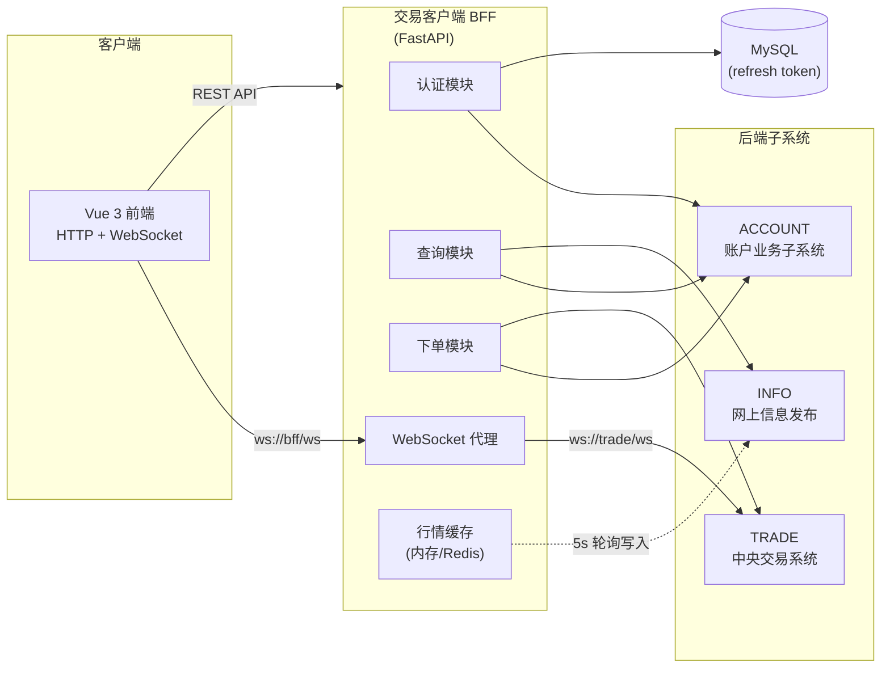

### 3.2 功能 IPO 图

**登录认证**

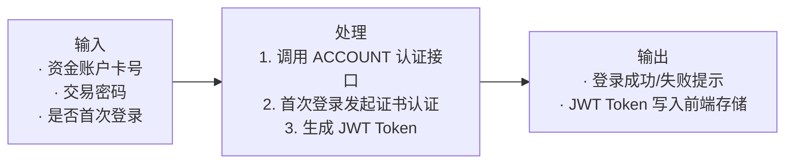

**买入委托**

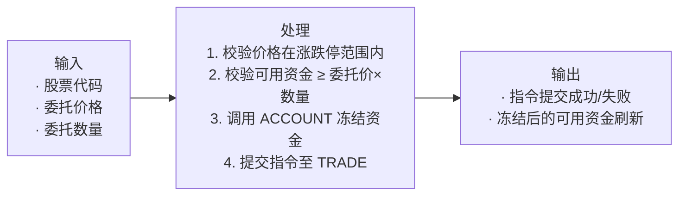

**撮合结果接收**

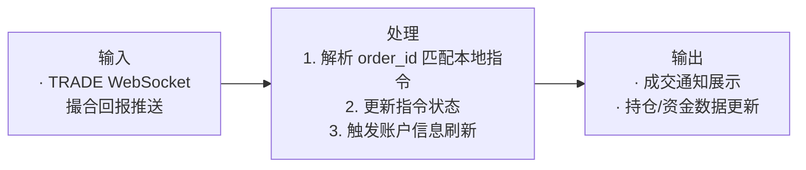

### 3.3 系统结构

交易客户端子系统内部按功能划分为 5 个核心服务模块，通过各 SystemClient 适配类调用外部子系统。

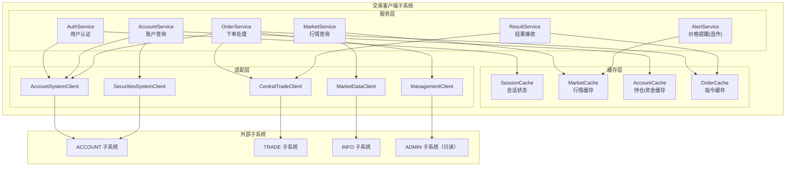

### 3.4 技术介绍

| 层次         | 技术选型                     | 说明                           |
| ------------ | ---------------------------- | ------------------------------ |
| 前端框架     | Vue 3 + Vite                 | 单页应用，组合式 API           |
| 前端状态管理 | Pinia                        | 管理会话、行情、账户、指令状态 |
| 前端路由     | Vue Router 4                 | 路由守卫实现登录鉴权           |
| HTTP 客户端  | Axios                        | 统一请求拦截、Token 注入       |
| WebSocket    | 浏览器原生 WebSocket API     | 接收撮合回报                   |
| BFF 后端     | Python 3.11 + FastAPI        | API 聚合代理                   |
| 数据验证     | Pydantic v2                  | 请求/响应模型                  |
| 数据库       | MySQL 8.0                    | 存储 refresh token             |
| ORM          | SQLAlchemy 2.0 + PyMySQL     | 数据库访问                     |
| 行情缓存     | 进程内存字典（可升级 Redis） | 5 秒行情快照                   |
| 身份认证     | JWT（python-jose）           | Bearer Token                   |
| 部署         | Uvicorn + Nginx              | ASGI 服务 + 反向代理           |

### 3.5 部署图

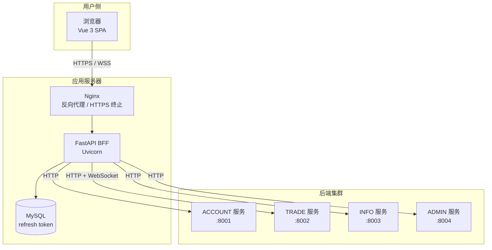

### 3.6 类图

```mermaid
classDiagram
    class AuthService {
        +login(fund_account_id, password) TokenResponse
        +logout()
        +change_password(fund_account_id, password_type, old_pw, new_pw)
        -_check_first_login(fund_account_id) bool
        -_handle_failure(fund_account_id)
    }

    class MarketService {
        +get_quote(stock_code) MarketQuote
        +search_stocks(keyword) list
        +start_polling()
        -_fetch_and_cache(stock_code)
    }

    class AccountService {
        +get_fund_account(fund_account_id) FundAccount
        +get_positions(security_account_id) list[SecurityPosition]
        +refresh_account()
        -_calc_cost_and_pnl(positions) list
    }

    class OrderService {
        +submit_order(req: OrderRequest) OrderResponse
        +cancel_order(order_id, investor_id) CancelResponse
        -_validate_price(stock_code, price, side)
        -_check_fund(fund_account_id, amount)
        -_check_position(security_account_id, stock_code, qty)
        -_freeze_fund(fund_account_id, order_id, amount)
    }

    class ResultService {
        +connect(token)
        +disconnect()
        -_on_message(msg)
        -_update_order_status(order_id, fill_data)
        -_trigger_account_refresh()
    }

    class AlertService {
        +add_alert(stock_code, target_price)
        +delete_alert(alert_id)
        +list_alerts() list
        -_check_price(stock_code, current_price)
    }

    class SessionCache {
        -_data: dict
        +set(investor_id, token, fund_id, security_id)
        +get() SessionData
        +clear()
    }

    class MarketCache {
        -_quotes: dict
        +write(stock_code, quote: MarketQuote)
        +read(stock_code) MarketQuote
    }

    class AccountCache {
        -_fund: FundAccount
        -_positions: list
        +update(fund, positions)
        +get_fund() FundAccount
        +get_positions() list
        +invalidate()
    }

    class OrderCache {
        -_orders: dict
        +add(order: TradeOrder)
        +get(order_id) TradeOrder
        +update_fill(order_id, fill_qty, fill_price, is_full)
        +update_status(order_id, status)
        +list_all() list
    }

    class AccountSystemClient {
        +login(fund_account_id, password) dict
        +change_password(fund_account_id, type, old, new)
        +get_fund_account(fund_account_id) dict
        +freeze_fund(fund_account_id, order_id, amount) dict
        +release_fund(fund_account_id, order_id, amount)
        +get_positions(security_account_id) dict
        +check_association(fund_id, security_id, op_type) dict
    }

    class CentralTradeClient {
        +submit_order(req) dict
        +cancel_order(order_id, investor_id) dict
        +get_order(order_id) dict
        +connect_ws(token, on_message)
        +disconnect_ws()
    }

    class MarketDataClient {
        +get_quote(stock_code) dict
        +search_stocks(keyword) dict
    }

    AuthService --> SessionCache
    AuthService --> AccountSystemClient
    MarketService --> MarketCache
    MarketService --> MarketDataClient
    AccountService --> AccountCache
    AccountService --> AccountSystemClient
    OrderService --> OrderCache
    OrderService --> AccountCache
    OrderService --> MarketCache
    OrderService --> AccountSystemClient
    OrderService --> CentralTradeClient
    ResultService --> OrderCache
    ResultService --> CentralTradeClient
    ResultService --> AccountService
    AlertService --> MarketCache
```

### 3.7 接口设计

#### 3.7.1 内部接口（BFF 对前端暴露）

基础前缀：`/api/v1/client`

| 方法 | 路径                                | 功能         | 调用模块       |
| ---- | ----------------------------------- | ------------ | -------------- |
| POST | `/auth/login`                       | 投资者登录   | AuthService    |
| POST | `/auth/logout`                      | 退出登录     | AuthService    |
| POST | `/auth/password`                    | 修改密码     | AuthService    |
| GET  | `/market/stocks`                    | 股票搜索     | MarketService  |
| GET  | `/market/stocks/{stock_code}/quote` | 查询行情     | MarketService  |
| GET  | `/accounts/fund`                    | 查询资金账户 | AccountService |
| GET  | `/accounts/positions`               | 查询持仓     | AccountService |
| POST | `/orders`                           | 提交委托     | OrderService   |
| GET  | `/orders`                           | 查询委托列表 | OrderCache     |
| GET  | `/orders/{order_id}`                | 查询单笔委托 | OrderCache     |
| POST | `/orders/{order_id}/cancel`         | 撤单         | OrderService   |
| WS   | `/ws/trade`                         | 撮合回报代理 | ResultService  |

#### 3.7.2 外部接口（调用其他子系统）

见第 3.3 节适配层及接口文档 V2 第 6-10 节，主要调用路径：

- **ACCOUNT**：`/api/v1/account/auth/login`、`/fund-accounts/*`、`/security-accounts/*`、`/associations/check`
- **TRADE**：`/api/v1/trade/orders`、`/market/*`、`ws://trade/api/v1/trade/ws/orders`
- **INFO**：`/api/v1/info/stocks/*`

------

## 4. 详细设计

### 4.1 顺序图

#### 4.1.1 投资者登录

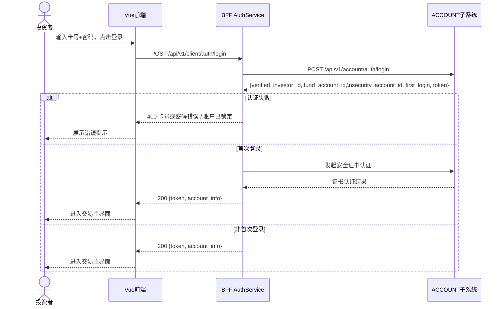

#### 4.1.2 发出买入委托

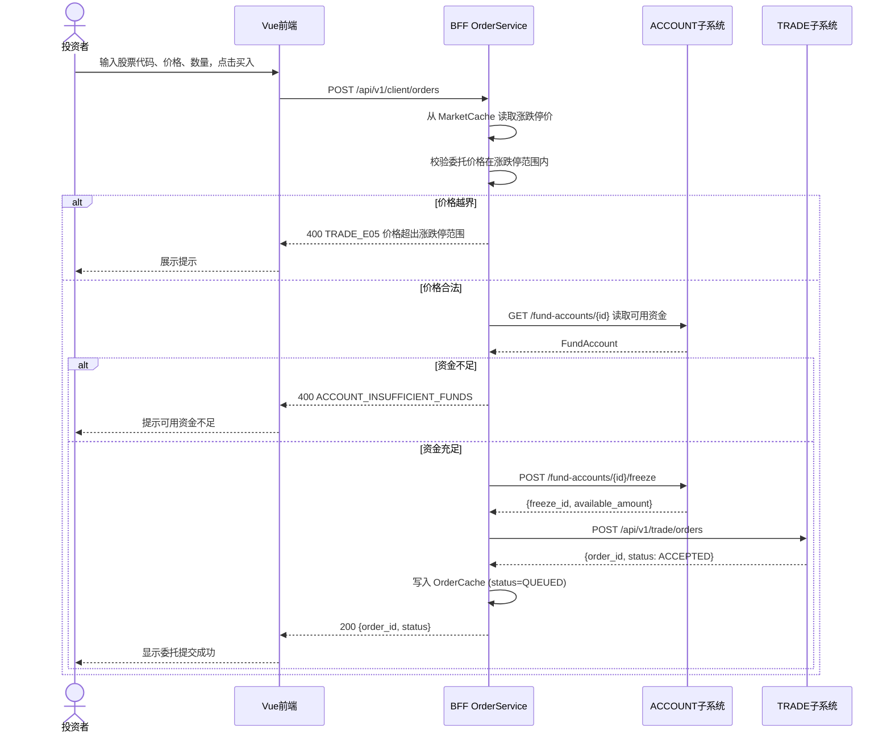

#### 4.1.3 撤销委托

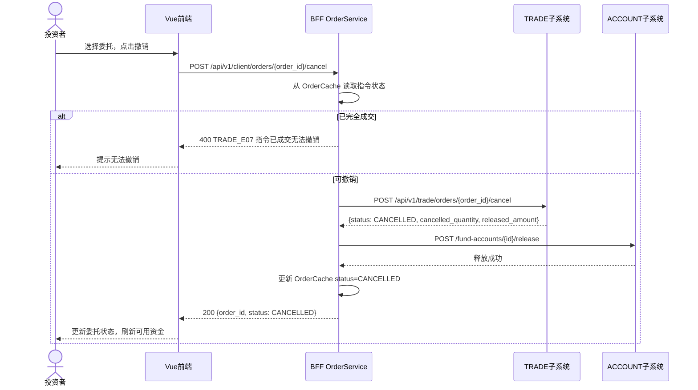

#### 4.1.4 撮合回报接收

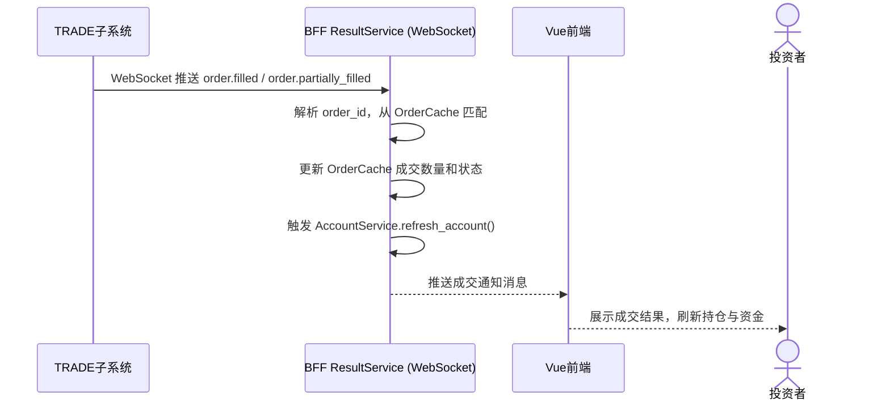

### 4.2 执行概念

#### 4.2.1 用户认证模块（tc001, tc002）

**模块概述**

负责投资者登录验证、会话管理和密码修改。认证结果由 ACCOUNT 子系统决定，BFF 负责转发并维护本地会话状态（JWT Token 写入 SessionCache）。

**输入项**

| 名称         | 标识            | 类型             | 说明                 |
| ------------ | --------------- | ---------------- | -------------------- |
| 资金账户卡号 | fund_account_id | string(16位数字) | 投资者唯一标识       |
| 交易密码     | password        | string(加密)     | 6-20位，含字母与数字 |
| 客户端时间   | client_time     | datetime         | ISO 8601             |

**输出项**

| 名称      | 标识         | 类型    | 说明                                              |
| --------- | ------------ | ------- | ------------------------------------------------- |
| JWT Token | token        | string  | 用于后续请求鉴权                                  |
| 账户信息  | account_info | object  | investor_id, fund_account_id, security_account_id |
| 登录结果  | verified     | boolean |                                                   |

**设计方法（算法）**

```
BEGIN login(fund_account_id, password):
  调用 ACCOUNT POST /auth/login
  IF 认证失败:
    记录失败计数（由 ACCOUNT 管理）
    返回错误码与原因
  END IF
  IF first_login == true:
    发起安全证书认证流程
    IF 证书失败:
      返回 401 证书认证失败
    END IF
  END IF
  将 {investor_id, fund_account_id, security_account_id, token} 写入 SessionCache
  返回 token 与账户信息
END

BEGIN change_password(fund_account_id, password_type, old_password, new_password):
  调用 ACCOUNT POST /auth/password
  IF 成功:
    清除本地 SessionCache，强制重新登录
  END IF
  返回操作结果
END
```

**流程图**

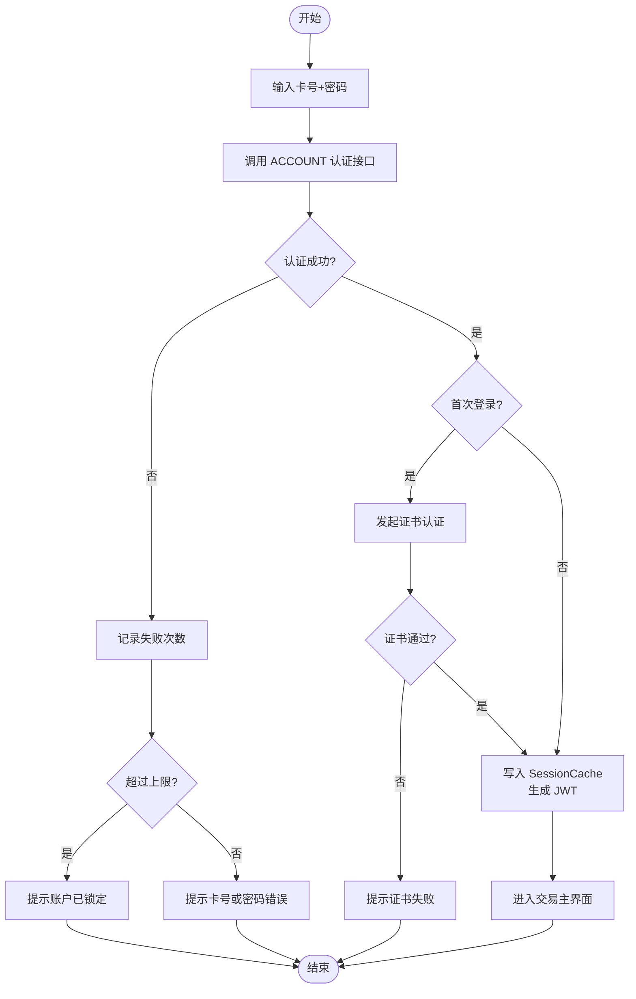

------

#### 4.2.2 行情查询模块（tc003）

**模块概述**

按需查询股票行情，并通过 5 秒定时轮询维护 MarketCache。下单模块从 MarketCache 直接读取涨跌停价，无需额外网络请求。

**输入项**

| 名称          | 标识    | 类型   | 说明                       |
| ------------- | ------- | ------ | -------------------------- |
| 股票代码/名称 | keyword | string | 支持精确代码和名称模糊匹配 |

**输出项**

| 名称     | 标识  | 类型        | 说明                         |
| -------- | ----- | ----------- | ---------------------------- |
| 行情快照 | quote | MarketQuote | 含最新价、高低价、买卖报价等 |

**设计方法（算法）**

```
BEGIN get_quote(stock_code):
  先从 MarketCache 读取
  IF 缓存命中 AND 时间戳距今 < 5s:
    返回缓存数据
  END IF
  调用 INFO GET /stocks/{stock_code}/quote
  IF 请求成功:
    写入 MarketCache
    返回 MarketQuote
  ELSE:
    返回 COMMON_NOT_FOUND 或上次缓存数据
  END IF
END

// 定时任务（BFF 后台协程，每 5 秒执行一次）
BEGIN polling_task():
  FOR EACH stock_code IN active_subscriptions:
    调用 INFO GET /stocks/{stock_code}/quote
    写入 MarketCache
    IF 有价格提醒模块:
      通知 AlertService 比对价格
    END IF
  END FOR
END
```

------

#### 4.2.3 账户查询模块（tc004, tc005）

**模块概述**

查询投资者的资金余额与证券持仓，计算持有成本和损益后写入 AccountCache。

**持仓成本与损益计算公式**

$$\text{持有成本} = \frac{\sum_{i=1}^{n} P_i \cdot S_i}{\sum_{i=1}^{n} S_i}$$

$$\text{持有损益} = \left( P_{\text{current}} - \text{持有成本} \right) \times S_{\text{total}}$$

其中 $P_i$ 为第 $i$ 次买入成本价，$S_i$ 为对应买入数量，$P_{\text{current}}$ 从 MarketCache 读取。

**设计方法（算法）**

```
BEGIN get_account_view(investor_id):
  并行执行：
    t1: 调用 ACCOUNT GET /fund-accounts/{fund_account_id}
    t2: 调用 ACCOUNT GET /security-accounts/{security_account_id}/positions
  AWAIT t1, t2
  IF 任一失败:
    返回错误，提示重试
  END IF
  FOR EACH position IN t2.positions:
    price = MarketCache.read(position.stock_code).latest_price
    position.pnl = (price - position.cost_price) * position.total_quantity
  END FOR
  AccountCache.update(t1, t2.positions)
  返回汇总结果
END
```

------

#### 4.2.4 下单处理模块（tc006, tc007, tc008）

**模块概述**

对买卖指令进行前置校验，冻结资金（买入）或冻结持仓（卖出），然后提交至 TRADE 子系统。处理撤单请求时需释放相应冻结资源。

**输入项（买入）**

| 名称     | 标识           | 类型           | 取值范围                             |
| -------- | -------------- | -------------- | ------------------------------------ |
| 股票代码 | stock_code     | string(6位)    | 数字                                 |
| 买卖方向 | side           | enum           | BUY / SELL                           |
| 委托价格 | order_price    | decimal string | 0 < price ≤ 100000，且在涨跌停范围内 |
| 委托数量 | order_quantity | int            | > 0，为 100 的整数倍                 |

**输出项**

| 名称     | 标识     | 类型   | 说明       |
| -------- | -------- | ------ | ---------- |
| 指令编号 | order_id | string | TRADE 返回 |
| 指令状态 | status   | enum   | ACCEPTED   |

**流程图（买入）**

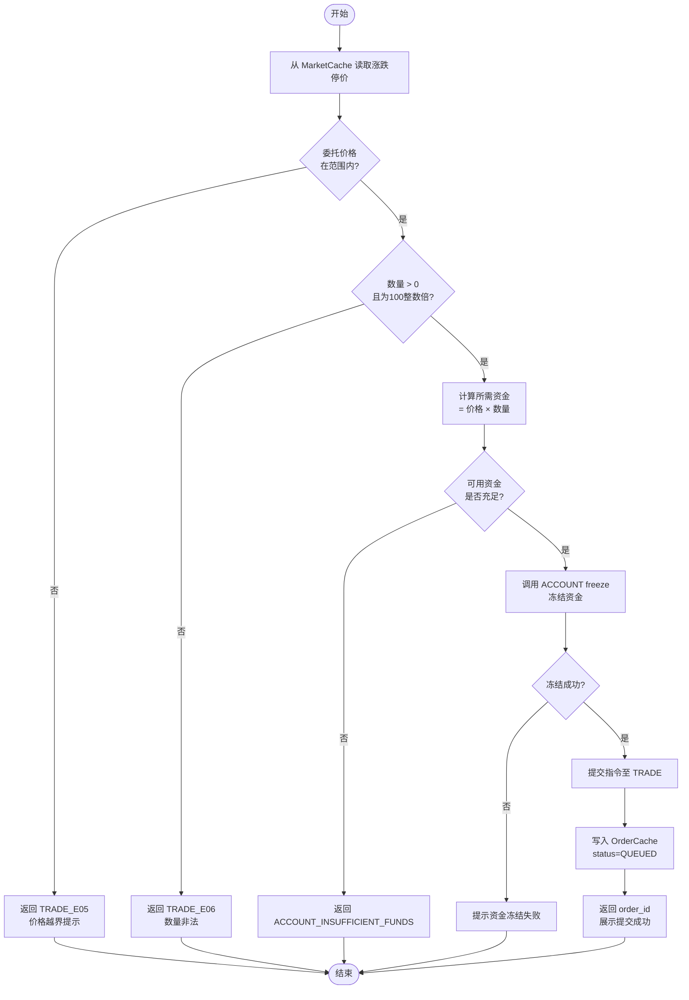

------

#### 4.2.5 结果接收模块（tc009）

**模块概述**

维护与 TRADE 子系统的 WebSocket 长连接，接收撮合回报，更新本地指令缓存，并触发账户信息刷新。

**WebSocket 连接地址：**
 `ws://<trade-host>/api/v1/trade/ws/orders?token=<token>`

**消息处理逻辑**

```
BEGIN on_message(raw_msg):
  msg = parse_json(raw_msg)
  SWITCH msg.type:
    CASE "order.filled":
      OrderCache.update_fill(msg.data.order_id, msg.data.trade_quantity, 
                              msg.data.trade_price, is_full=True)
      AccountService.refresh_account()
      notify_frontend("完全成交", msg.data)
    CASE "order.partially_filled":
      OrderCache.update_fill(msg.data.order_id, msg.data.trade_quantity,
                              msg.data.trade_price, is_full=False)
      AccountService.refresh_account()
      notify_frontend("部分成交", msg.data)
    CASE "order.cancelled" | "order.expired":
      OrderCache.update_status(msg.data.order_id, msg.type)
      AccountService.refresh_account()
      notify_frontend(msg.type, msg.data)
    CASE "pong":
      reset_heartbeat_timer()
    DEFAULT:
      log_warning("未知消息类型", msg.type)
  END SWITCH
END

// 心跳保活（每 30 秒发送一次）
BEGIN heartbeat_loop():
  WHILE connected:
    send({"type": "ping", "sent_at": now()})
    SLEEP 30s
  END WHILE
END

// 断线重连（指数退避）
BEGIN reconnect(retry_count):
  delay = min(2^retry_count, 60) 秒
  SLEEP delay
  IF retry_count >= 5:
    通知前端手动刷新
    RETURN
  END IF
  尝试重新连接 WebSocket
  retry_count += 1
END
```

------

## 5. 用户界面

### 5.1 登录界面

投资者输入资金账户卡号与交易密码，点击登录。错误时展示具体提示（卡号或密码错误/账户锁定）。首次登录跳转证书认证步骤。

### 5.2 交易主界面

登录成功后进入，包含顶部导航栏与左侧菜单：

- 行情查询
- 持仓/资金查询
- 买入 / 卖出
- 委托列表（含撤单操作）
- 修改密码
- （选作）价格提醒

界面右下角实时显示 WebSocket 连接状态（已连接/重连中）。

### 5.3 委托列表界面

展示当前会话全部委托，列表包含字段：委托编号、股票代码/名称、方向、委托价格、委托数量、已成交数量、当前状态（待成交/部分成交/完全成交/已撤销/已过期）、提交时间。可撤销状态的委托显示"撤销"按钮。

------

## 6. 数据库设计

### 6.1 概念结构设计

本子系统数据库仅用于存储 Refresh Token（JWT 刷新令牌），业务数据不在本子系统持久化。

E-R 图：

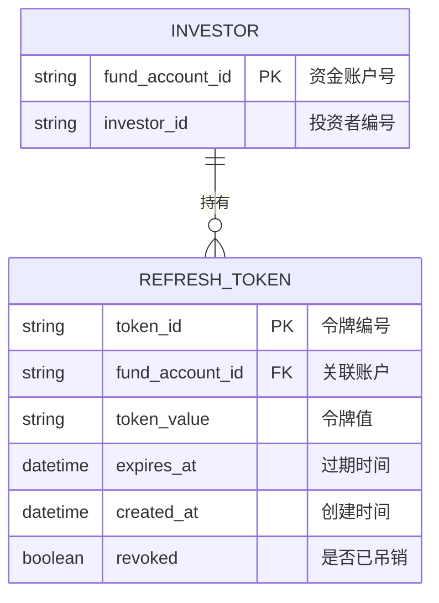

### 6.2 逻辑结构设计

```
investor (fund_account_id, investor_id)

refresh_token (token_id, fund_account_id, token_value, 
               expires_at, created_at, revoked)
```

外键：`refresh_token.fund_account_id` → `investor.fund_account_id`

### 6.3 物理结构设计

**表 1：投资者信息表（investor）**

| 编号 | 属性名     | 字段名          | 数据类型 | 长度 | 备注 |
| ---- | ---------- | --------------- | -------- | ---- | ---- |
| 1    | 资金账户号 | fund_account_id | VARCHAR  | 16   | 主键 |
| 2    | 投资者编号 | investor_id     | VARCHAR  | 20   | 非空 |

**表 2：刷新令牌表（refresh_token）**

| 编号 | 属性名     | 字段名          | 数据类型 | 长度 | 备注         |
| ---- | ---------- | --------------- | -------- | ---- | ------------ |
| 1    | 令牌编号   | token_id        | VARCHAR  | 36   | 主键（UUID） |
| 2    | 资金账户号 | fund_account_id | VARCHAR  | 16   | 外键         |
| 3    | 令牌值     | token_value     | VARCHAR  | 512  | 非空         |
| 4    | 过期时间   | expires_at      | DATETIME | -    | 非空         |
| 5    | 创建时间   | created_at      | DATETIME | -    | 非空         |
| 6    | 是否吊销   | revoked         | TINYINT  | 1    | 默认 0       |

------

## 7. 运行设计

**投资者登录流程：**

1. 访问系统登录页，输入资金账户卡号和交易密码。
2. 系统验证通过后自动进入交易主界面，WebSocket 连接自动建立。
3. 行情轮询后台自动启动，每 5 秒刷新已订阅股票的行情缓存。

**投资者买入操作：**

1. 在行情查询页搜索目标股票，查看最新价和涨跌停限制。
2. 点击"买入"，输入委托价格和数量，系统自动展示参考价。
3. 确认后系统校验资金，冻结成功后委托提交至中央交易系统。
4. 委托列表实时更新状态；成交后右下角弹出成交通知，持仓和资金自动刷新。

**投资者卖出操作：**

1. 在持仓列表中选择要卖出的股票，点击"卖出"。
2. 输入卖出价格（系统展示涨跌停上下限）和数量。
3. 系统校验持仓，冻结证券后提交委托。

**投资者撤单操作：**

1. 在委托列表中找到待撤销委托，点击"撤销"。
2. 系统确认指令未完全成交后，调用中央交易系统撤单。
3. 撤单成功后冻结资金/持仓自动释放，委托状态更新为"已撤销"。

**退出登录：**

1. 点击退出，BFF 清除 SessionCache，前端清除本地存储的 Token。
2. WebSocket 连接主动断开。

------

## 8. 系统出错设计

### 8.1 出错信息

| 系统输出信息                  | 含义                     | 处理办法                             |
| ----------------------------- | ------------------------ | ------------------------------------ |
| COMMON_UNAUTHORIZED           | 未登录或 Token 失效      | 跳转登录页                           |
| TRADE_E03                     | 股票暂停或收盘，不可交易 | 提示用户，禁止提交                   |
| TRADE_E05                     | 委托价格超出涨跌停范围   | 提示并清空价格输入框                 |
| ACCOUNT_INSUFFICIENT_FUNDS    | 可用资金不足             | 提示并展示当前可用资金               |
| ACCOUNT_INSUFFICIENT_POSITION | 可用持仓不足             | 提示并展示当前可卖数量               |
| ACCOUNT_STATUS_BLOCKED        | 账户被冻结或挂失         | 提示联系客服                         |
| WebSocket 断开                | 网络异常或服务端重启     | 指数退避重连，超限后提示手动刷新     |
| 行情拉取失败                  | INFO 服务不可达          | 展示上次缓存数据，标记"数据可能延迟" |

### 8.2 补救措施

#### 8.2.1 系统恢复

系统崩溃后，BFF 进程重启后优先重建 WebSocket 连接，行情轮询任务自动恢复。SessionCache 为内存存储，重启后用户需重新登录；Refresh Token 持久化在 MySQL 中，支持无感刷新。

#### 8.2.2 定时备份

用户 Refresh Token 随 MySQL 定期备份。业务数据由各后端子系统（ACCOUNT、TRADE）负责备份，本子系统不重复存储。

#### 8.2.3 人工操作

若用户报告委托状态异常（如资金已扣但指令未显示），可通过 TRADE `/orders/{order_id}` 接口查询真实状态进行人工核对。

### 8.3 系统维护设计

1. 所有 BFF 接口请求均记录 `X-Request-Id`、请求路径、响应码和耗时，便于跨子系统链路追踪。
2. 密码、Token 等敏感信息不写入日志。
3. BFF 暴露 `/health` 端点，用于监控存活状态：

```json
{
  "service": "client-bff",
  "status": "UP",
  "time": "2026-05-28T10:30:00+08:00"
}
```

1. 提供 FastAPI `/docs` 与 `/openapi.json`，便于其他组联调参考。
2. 核心模块（OrderService 冻结/释放资金、ResultService 回报处理）需编写单元测试，覆盖正常路径和异常路径。
3. 所有写接口支持 `X-Idempotency-Key`，防止网络重试导致重复下单或重复冻结。