# 股票交易系统——交易客户端子系统
```mermaid
flowchart TB
  subgraph CLIENT[交易客户端子系统]
    direction TB

    subgraph Services[服务层]
      direction TB
      AuthSvc["AuthService\n登录与证书"]
      StateSvc["ClientStateService\n提醒/通知/自选/偏好"]
      AccountSvc["AccountAggregationService\n资产聚合"]
      OrderSvc["TradeOrchestrationService\n交易编排"]
      ResultSvc["ResultSyncService\n成交回报同步"]
    end

    subgraph CacheLayer[缓存层]
      direction TB
      SessionCache["SessionCache\n会话状态"]
      MarketCache["MarketCache\n行情缓存"]
      AccountCache["AccountCache\n持仓/资金缓存"]
      OrderCache["OrderCache\n指令缓存"]
    end

    subgraph Adapters[适配层]
      direction TB
      authAdapter[authAdapter]
      fundsAdapter[fundsAdapter]
      securitiesAdapter[securitiesAdapter]
      exchangeAdapter[exchangeAdapter]
      marketAdapter[marketAdapter]
      managementAdapter[managementAdapter]
    end

    subgraph DataLayer[数据层]
      direction TB
      ClientDB[(Client SQLite)]
    end
  end

  subgraph External[外部业务服务]
    direction TB
    ACCOUNT[ACCOUNT 子系统]
    SECURITIES[SECURITIES 子系统]
    TRADE[TRADE 子系统]
    INFO[INFO 子系统]
    ADMIN[ADMIN 子系统]
  end

  AuthSvc --> SessionCache
  StateSvc --> SessionCache
  StateSvc --> MarketCache
  AccountSvc --> MarketCache
  AccountSvc --> AccountCache
  OrderSvc --> OrderCache
  ResultSvc --> OrderCache

  AuthSvc --> authAdapter
  AccountSvc --> fundsAdapter
  AccountSvc --> securitiesAdapter
  AccountSvc --> marketAdapter
  OrderSvc --> fundsAdapter
  OrderSvc --> securitiesAdapter
  OrderSvc --> exchangeAdapter
  OrderSvc --> managementAdapter
  ResultSvc --> exchangeAdapter
  ResultSvc --> fundsAdapter
  ResultSvc --> securitiesAdapter

  AuthSvc --> ClientDB
  StateSvc --> ClientDB
  authAdapter --> ClientDB

  fundsAdapter --> ACCOUNT
  securitiesAdapter --> SECURITIES
  exchangeAdapter --> TRADE
  marketAdapter --> INFO
  managementAdapter --> ADMIN
```
- [股票交易系统——交易客户端子系统](#股票交易系统交易客户端子系统)
- [1. 文档介绍](#1-文档介绍)
  - [1.1 编写目的](#11-编写目的)
  - [1.2 文档范围](#12-文档范围)
  - [1.3 读者对象](#13-读者对象)
  - [1.4 术语与缩写解释](#14-术语与缩写解释)
    - [1.5 参考资料](#15-参考资料)
- [2. 项目介绍](#2-项目介绍)
  - [2.1 项目说明](#21-项目说明)
  - [2.2 项目背景](#22-项目背景)
  - [2.3 项目目标](#23-项目目标)
  - [2.4 功能需求](#24-功能需求)
    - [2.4.1 核心功能需求](#241-核心功能需求)
    - [2.4.2 体验增强功能需求](#242-体验增强功能需求)
  - [2.5 性能需求](#25-性能需求)
  - [2.6 安全需求](#26-安全需求)
  - [2.7 条件与限制](#27-条件与限制)
- [3. 总体设计](#3-总体设计)
  - [3.1 基本设计概念和流程处理](#31-基本设计概念和流程处理)
  - [3.2 关键业务流程](#32-关键业务流程)
    - [3.2.1 账户资产查询](#321-账户资产查询)
    - [3.2.2 买入委托](#322-买入委托)
    - [3.2.3 卖出委托](#323-卖出委托)
    - [3.2.4 撤销委托](#324-撤销委托)
    - [3.2.5 成交回报](#325-成交回报)
    - [3.2.6 价格提醒](#326-价格提醒)
  - [3.3 系统结构](#33-系统结构)
    - [3.3.1 子系统边界](#331-子系统边界)
    - [3.3.2 分层结构](#332-分层结构)
      - [3.3.2.1 前端层](#3321-前端层)
      - [3.3.2.2 网关层](#3322-网关层)
      - [3.3.2.3 适配层](#3323-适配层)
      - [3.3.2.4 功能模块结构](#3324-功能模块结构)
  - [3.4 技术介绍](#34-技术介绍)
  - [3.5 部署图](#35-部署图)
    - [3.5.1 本地开发模式](#351-本地开发模式)
    - [3.5.2 联调模式](#352-联调模式)
  - [3.6 类图](#36-类图)
    - [3.6.1 总体数据流](#361-总体数据流)
  - [3.7 接口设计](#37-接口设计)
    - [3.7.1 接口设计原则](#371-接口设计原则)
    - [3.7.2 内部接口](#372-内部接口)
    - [3.7.3 前端—Client Gateway 接口](#373-前端client-gateway-接口)
    - [3.7.4 外部接口](#374-外部接口)
      - [3.7.4.1 ACCOUNT 账户业务接口](#3741-account-账户业务接口)
      - [3.7.4.2 TRADE 中央交易系统接口](#3742-trade-中央交易系统接口)
      - [3.7.4.3 INFO 网上信息发布接口](#3743-info-网上信息发布接口)
      - [3.7.4.4 ADMIN 交易系统管理接口](#3744-admin-交易系统管理接口)
    - [3.7.5 字段与状态约定](#375-字段与状态约定)
- [4. 详细设计](#4-详细设计)
  - [4.1 用户认证模块](#41-用户认证模块)
    - [4.1.1 模块职责](#411-模块职责)
    - [4.1.2 登录动作](#412-登录动作)
    - [4.1.3 登录顺序图](#413-登录顺序图)
    - [4.1.4 登录算法](#414-登录算法)
  - [4.2 客户端权限申请模块](#42-客户端权限申请模块)
    - [4.2.1 模块职责](#421-模块职责)
    - [4.2.2 处理流程](#422-处理流程)
    - [4.2.3 设计要求](#423-设计要求)
  - [4.3 行情查询模块](#43-行情查询模块)
    - [4.3.1 模块职责](#431-模块职责)
    - [4.3.2 行情查询流程](#432-行情查询流程)
    - [4.3.3 行情数据结构](#433-行情数据结构)
  - [4.4 账户资产模块](#44-账户资产模块)
    - [4.4.1 模块职责](#441-模块职责)
    - [4.4.2 资产聚合流程](#442-资产聚合流程)
    - [4.4.3 持仓成本和盈亏计算](#443-持仓成本和盈亏计算)
  - [4.5 交易委托模块](#45-交易委托模块)
  - [4.5.1 买入委托流程](#451-买入委托流程)
    - [输入项](#输入项)
    - [买入顺序图](#买入顺序图)
    - [买入算法](#买入算法)
  - [4.5.2 卖出委托流程](#452-卖出委托流程)
    - [可卖数量定义](#可卖数量定义)
    - [卖出算法](#卖出算法)
  - [4.5.3 撤单流程](#453-撤单流程)
    - [撤单规则](#撤单规则)
  - [4.6 成交回报模块](#46-成交回报模块)
    - [4.6.1 模块定位](#461-模块定位)
    - [4.6.2 当前实现模式](#462-当前实现模式)
    - [4.6.3 后续升级模式](#463-后续升级模式)
    - [4.6.4 mock 模式清算说明](#464-mock-模式清算说明)
  - [4.7 价格提醒模块](#47-价格提醒模块)
    - [4.7.1 模块职责](#471-模块职责)
    - [4.7.2 提醒触发流程](#472-提醒触发流程)
    - [4.7.3 触发条件](#473-触发条件)
  - [4.8 安全设置模块](#48-安全设置模块)
  - [4.9 状态图设计补充](#49-状态图设计补充)
    - [4.9.1 用户登录状态图](#491-用户登录状态图)
    - [4.9.2 行情查询状态图](#492-行情查询状态图)
    - [4.9.3 委托状态图](#493-委托状态图)
    - [4.9.4 价格提醒状态图](#494-价格提醒状态图)
- [](#)
- [5. 用户界面](#5-用户界面)
  - [5.1 界面总体布局](#51-界面总体布局)
  - [5.2 页面设计](#52-页面设计)
  - [5.3 组件设计](#53-组件设计)
  - [5.4 交互状态设计](#54-交互状态设计)
  - [5.5 下单页面交互规则](#55-下单页面交互规则)
- [6. 数据库设计](#6-数据库设计)
  - [6.1 数据归属原则](#61-数据归属原则)
  - [6.2 概念结构设计](#62-概念结构设计)
  - [6.3 SQLite 逻辑结构设计](#63-sqlite-逻辑结构设计)
  - [6.4 SQLite 物理结构设计](#64-sqlite-物理结构设计)
    - [6.4.1 client\_users](#641-client_users)
    - [6.4.2 client\_certificates](#642-client_certificates)
    - [6.4.3 client\_alerts](#643-client_alerts)
    - [6.4.4 其他表](#644-其他表)
  - [6.5 外部业务数据模型（模拟后端简易版）](#65-外部业务数据模型模拟后端简易版)
    - [6.5.1 资金账户数据](#651-资金账户数据)
    - [6.5.2 持仓数据](#652-持仓数据)
    - [6.5.3 委托数据](#653-委托数据)
    - [6.5.4 成交回报数据](#654-成交回报数据)
- [7. 运行设计](#7-运行设计)
  - [7.1 运行模式](#71-运行模式)
  - [7.2 mock 模式启动步骤](#72-mock-模式启动步骤)
  - [7.3 环境变量](#73-环境变量)
  - [7.4 典型运行流程](#74-典型运行流程)
    - [7.4.1 登录流程](#741-登录流程)
    - [7.4.2 行情流程](#742-行情流程)
    - [7.4.3 买入流程](#743-买入流程)
    - [7.4.4 卖出流程](#744-卖出流程)
    - [7.4.5 撤单流程](#745-撤单流程)
  - [7.5 联调运行设计](#75-联调运行设计)
  - [7.6 测试设计](#76-测试设计)
- [8. 系统出错设计](#8-系统出错设计)
  - [8.1 错误码设计](#81-错误码设计)
  - [8.2 出错处理原则](#82-出错处理原则)
  - [8.3 补救措施](#83-补救措施)
  - [8.4 维护设计](#84-维护设计)
- [附录 A：功能需求到设计模块映射](#附录-a功能需求到设计模块映射)

---

# 1. 文档介绍

## 1.1 编写目的

本文档描述股票交易系统交易客户端子系统（CLIENT）的详细设计说明书，目的如下：

1. 定义交易客户端的总体架构与模块划分，作为前后端开发的实现依据；
2. 明确与其他子系统（ACCOUNT、TRADE、INFO、ADMIN）之间的接口约定，作为联调和测试依据；
3. 提供数据模型、处理逻辑和出错处理设计，作为代码评审与验收的基础。

## 1.2 文档范围

本文档覆盖交易客户端子系统的总体设计、详细设计、用户界面、数据库设计、运行设计和出错处理设计。主要功能包括：覆盖交易客户端子系统的全部功能模块：用户认证（tc001-tc002）、信息查询（tc003-tc005）、交易操作（tc006-tc008）、结果展示（tc009）及选作功能价格提醒（tc010），以及其他附加体验增强功能。


本文档覆盖交易客户端子系统的下列内容：

- 客户端权限申请；
- 首次登录、普通登录、证书绑定、证书验证、证书重绑；
- 股票行情查询、股票详情、行情刷新、股票搜索；
- 资金账户查询、证券持仓查询、资产汇总、资金流水、证券流水；
- 买入委托、卖出委托、委托撤销、委托列表、成交回报；
- 成交后资金与持仓刷新；
- 交易密码与取款密码修改；
- 价格提醒、自选股、通知、偏好设置；
- 本地开发模式与真实接口联调模式；
- 数据库设计、接口设计、运行设计和出错处理设计。

## 1.3 读者对象

交易客户端前后端开发人员、各子系统联调对接人员、测试人员。

## 1.4 术语与缩写解释

| 术语 | 解释 |
|---|---|
| CLIENT | 交易客户端子系统，本组负责的子系统 |
| Client Gateway | 客户端统一网关，前端只调用该网关，不直接调用其他组服务 |
| Adapter | 外部服务适配层，负责将网关内部请求转换为资金、证券、撮合、行情等外部系统接口调用 |
| Mock 服务 | 本地模拟的外部业务服务，用于独立开发与联调前测试 |
| 资金账户系统 | 维护资金余额、冻结资金、交易密码、取款密码、资金流水的外部系统 |
| 证券账户系统 | 维护证券持仓、可卖数量、冻结数量、证券流水的外部系统 |
| 中央交易系统 | 维护委托、撤单、撮合、成交回报的外部系统 |
| 网上信息发布系统 | 维护股票行情、股票名称、公告和行情刷新数据的外部系统 |
| 交易系统管理系统 | 维护涨跌停规则、停牌/复牌状态等交易控制信息的外部系统 |
| IndexedDB | 浏览器本地数据库，用于保存本机证书私钥 |
| SQLite | 客户端网关侧轻量数据库，仅保存客户端自有数据 |
| 证书绑定 | 首次登录时生成本机公私钥，将公钥绑定到账户 |
| 证书验证 | 登录时由网关下发 challenge，前端使用本机私钥签名，网关用公钥验签 |
| 冻结资金 | 买入委托提交后，为防止重复使用而暂时冻结的资金 |
| 冻结持仓 | 卖出委托提交后，为防止重复卖出而暂时冻结的证券数量 |
| 成交回报 | 中央交易系统产生的成交结果，包括成交价格、成交数量和对应委托编号 |

### 1.5 参考资料

| 序号 | 文档名称                         | 版本   |
| ---- | -------------------------------- | ------ |
| 1    | 股票交易系统交易客户端需求说明书 | 1.0    |
| 2    | 股票交易系统五组接口约定         | V2     |
| 3    | FastAPI 官方文档                 | 0.115+ |
| 4    | Vue 3 官方文档                   | 3.x    |

---

# 2. 项目介绍

## 2.1 项目说明

| 项目 | 内容 |
|---|---|
| 大项目名称 | 股票交易系统 |
| 子系统名称 | 交易客户端子系统 |
| 任务提出者 | 软件工程课程组 |
| 开发者 | 交易客户端开发小组 |
| 主要用户 | 持有资金账户和证券账户的投资者 |
| 间接用户 | 证券经纪商工作人员、系统管理员、其他子系统开发人员 |

股票交易系统由证券账户业务、资金账户业务、交易客户端、股票中央交易系统、网上信息发布系统和交易系统管理等部分组成。交易客户端是投资者直接使用的交互入口，负责完成登录认证、股票查询、资产查询、买卖委托、撤单、交易结果展示等操作。

## 2.2 项目背景

在课程实验中，各小组分别开发股票交易系统的不同子系统。交易客户端与其他子系统存在强依赖关系：

- 登录和密码验证依赖资金账户系统；
- 持仓查询依赖证券账户系统；
- 买卖委托和撤单依赖中央交易系统；
- 股票行情和公告依赖网上信息发布系统；
- 涨跌停、停牌/复牌等规则依赖交易系统管理系统。

由于其他组接口和实现由不同小组分别完成，交易客户端需要在保证用户体验的同时保持稳定的联调边界。因此，本设计采用“统一网关 + adapters”的结构：前端只调用客户端网关，网关通过适配层调用外部子系统。开发阶段可使用 mock 服务进行独立测试，联调阶段则通过适配层切换为真实服务。

## 2.3 项目目标

交易客户端子系统的核心目标是：

> 为投资者提供一个安全、清晰、实时、可操作的股票交易入口，使其能够完成从登录、行情查看、资产查看、下单、撤单到交易结果查看的完整闭环。

具体目标包括：

1. 提供客户端权限申请、首次登录、普通登录和证书验证流程；
2. 提供股票列表、搜索、详情和价格区间展示；
3. 提供资金账户、证券持仓、资产汇总、资金流水、证券流水查询；
4. 支持买入、卖出、撤单和委托状态管理；
5. 支持成交回报查询，并在成交后刷新资金和持仓；
6. 支持交易密码、取款密码修改；
7. 支持价格提醒、自选股、通知、偏好设置等用户体验增强功能；
8. 支持本地开发模式和真实联调模式，并能够通过替换 adapters 对接外部子系统。

## 2.4 功能需求

### 2.4.1 核心功能需求

| 编号 | 模块 | 功能 | 优先级 | 最终设计说明 |
|---|---|---|---|---|
| TC001 | 用户认证 | 登录客户端 | 必须 | 使用账户 + 交易密码 + 本机证书验证 |
| TC002 | 用户认证 | 修改密码 | 必须 | 支持交易密码和取款密码修改 |
| TC003 | 信息查询 | 查询股票信息 | 必须 | 支持代码/名称搜索，展示最新价、买一卖一、高低价、公告 |
| TC004 | 信息查询 | 查询持仓信息 | 必须 | 展示股票代码、名称、总股数、可卖数量、成本价、盈亏 |
| TC005 | 信息查询 | 查询资金账户 | 必须 | 展示可用资金、冻结资金、证券市值、资产总值 |
| TC006 | 交易操作 | 发出买入指令 | 必须 | 校验资金、价格、数量，冻结资金后提交委托 |
| TC007 | 交易操作 | 发出卖出指令 | 必须 | 校验可卖数量、价格、数量，冻结持仓后提交委托 |
| TC008 | 交易操作 | 撤销指令 | 必须 | 未成交/部分成交可撤，完全成交不可撤 |
| TC009 | 结果展示 | 显示交易结果 | 必须 | 展示成交回报，成交后刷新资金与持仓 |
| TC010 | 高级提醒 | 价格提醒 | 选作 | 支持新增、暂停、恢复、删除、触发提醒 |

### 2.4.2 体验增强功能需求

| 模块 | 功能 | 设计说明 |
|---|---|---|
| 客户端权限 | 客户端申请 | 未开通客户端权限时先申请，审核通过后允许登录 |
| 安全认证 | 证书重绑 | 换设备或证书丢失时通过账户、密码、手机号、身份证号重绑 |
| 首页工作台 | 资产和待办概览 | 展示资产、最新委托、最新成交、提醒等摘要 |
| 流水查询 | 资金流水 / 证券流水 | 展示存取款、买入成交、卖出成交等记录 |
| 自选股 | Watchlist | 用户可收藏或取消收藏股票 |
| 通知中心 | Notifications | 展示系统通知、提醒触发通知 |
| 偏好设置 | Preferences | 保存刷新模式、主题等客户端偏好 |

## 2.5 性能需求

| 指标 | 要求 |
|---|---|
| 行情刷新频率 | 不低于每 5 秒一次；当前 mock 行情服务 5 秒更新一次 |
| 页面响应时间 | 本地 mock 环境下主要交互响应时间应小于 1 秒 |
| 委托提交响应 | 本地 mock 环境下应小于 2 秒；真实联调环境应展示加载状态和失败提示 |
| 数据刷新 | 下单、撤单、成交后应刷新委托、资金、持仓和成交回报 |
| 可维护性 | 前端不直接调用外部系统；更换外部服务时主要修改 adapters |

## 2.6 安全需求

| 安全点 | 要求 |
|---|---|
| 登录认证 | 使用资金账户号/账户名 + 交易密码登录 |
| 首次登录 | 首次登录必须绑定本机证书 |
| 证书验证 | 已绑定证书后通过 challenge-signature 机制验证本机身份 |
| 证书重绑 | 需校验交易密码、手机号、身份证号等信息 |
| 密码修改 | 修改交易密码和取款密码必须校验原密码 |
| 敏感数据 | 私钥只保存在浏览器 IndexedDB，不上传网关；网关只保存公钥 |
| 传输安全 | mock 模式可使用 HTTP，联调/部署时应切换 HTTPS/WSS |
| 服务端校验 | 下单必须在网关侧再次校验，不允许只依赖前端校验 |

## 2.7 条件与限制

1. 当前实现使用 Node.js CommonJS 编写 Client Gateway 和 mock 服务；
2. 当前前端使用 Vue 3 + Vite + Vue Router + Pinia 或类 Pinia 状态逻辑；
3. 当前客户端自有数据使用 SQLite；
4. 当前外部服务使用 JSON 文件作为 mock 持久化；
5. 当前未实现真实 WebSocket 推送，成交回报通过轮询或刷新查询获得；
6. 当前 mock 撮合逻辑简化，不完全实现真实价格优先和时间优先队列；
7. 当前资金冻结、持仓冻结逻辑不够完整，最终设计要求补齐；
8. 后续联调时，前端页面和网关 API 不应大改，主要改 adapters。

---

# 3. 总体设计

## 3.1 基本设计概念和流程处理

最终架构如下：

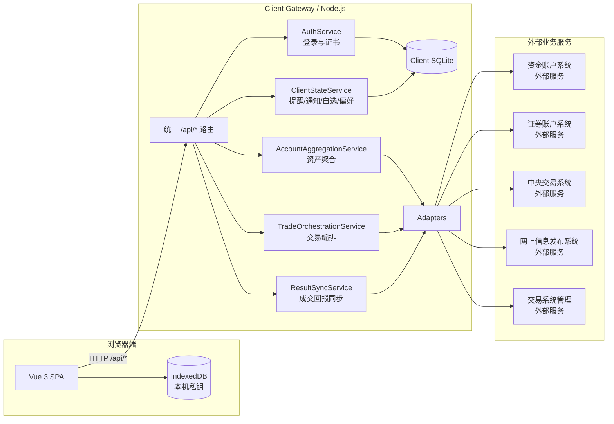

## 3.2 关键业务流程

### 3.2.1 账户资产查询

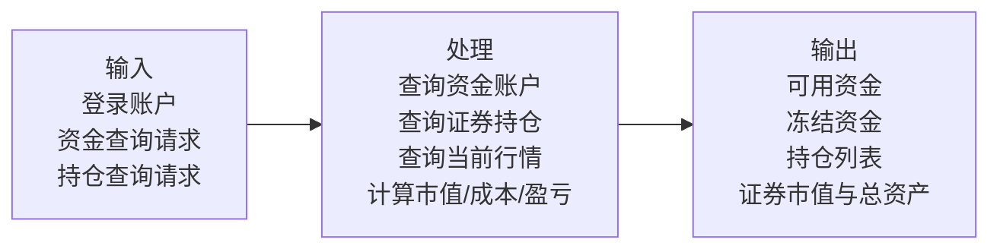

### 3.2.2 买入委托

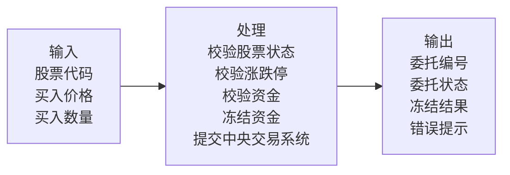

### 3.2.3 卖出委托

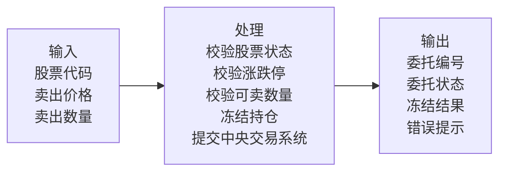

### 3.2.4 撤销委托

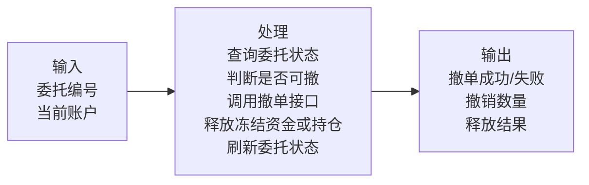

### 3.2.5 成交回报

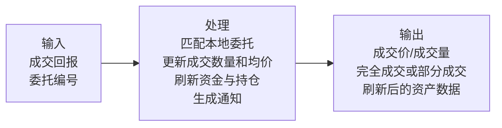

### 3.2.6 价格提醒

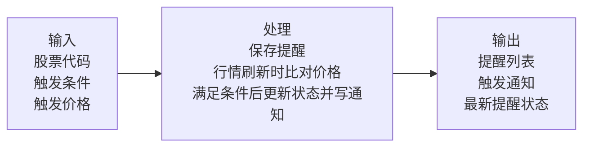

## 3.3 系统结构
交易客户端子系统按前端层、网关层、适配层、缓存层与外部业务服务分层，网关层以五个核心服务模块为中心，通过适配层对接外部子系统与内部数据库。

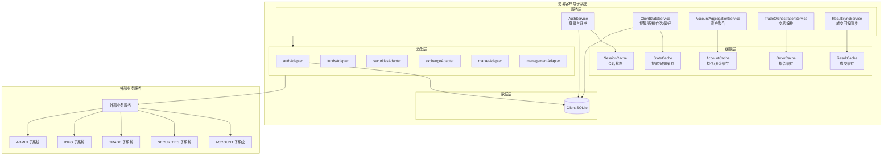
### 3.3.1 子系统边界

交易客户端只负责“投资者交互入口”和“接口编排”，不负责中央撮合、不负责资金账户开户、不负责证券账户开户、不负责交易规则管理。

| 数据 / 能力 | 权威系统 | 客户端职责 |
|---|---|---|
| 客户端权限申请 | CLIENT | 维护申请记录、客户端准入状态 |
| 证书公钥 | CLIENT | 保存公钥、完成验签 |
| 证书私钥 | 浏览器 IndexedDB | 仅本机保存，不上传服务器 |
| 登录记录 | CLIENT | 保存登录时间、方式、设备、状态 |
| 价格提醒 | CLIENT | 保存提醒规则，基于行情触发提示 |
| 通知 / 自选股 / 偏好 | CLIENT | 保存客户端体验数据 |
| 资金余额 / 冻结资金 | 资金账户系统 | 查询、展示；买入前申请冻结；撤单/过期申请释放 |
| 证券持仓 / 冻结持仓 | 证券账户系统 | 查询、展示；卖出前申请冻结；撤单/过期申请释放 |
| 委托 / 撤单 / 成交回报 | 中央交易系统 | 提交委托、请求撤单、查询状态和成交结果 |
| 股票行情 / 公告 | 网上信息发布系统 | 查询、展示、缓存 |
| 涨跌停 / 停牌状态 | 交易系统管理系统 | 下单前读取并校验 |

### 3.3.2 分层结构

交易客户端子系统内部按前端层、网关层和适配层分工协作。前端层不直接访问外部业务服务，网关层负责统一校验、聚合与编排，适配层负责对接各外部子系统并完成字段映射与错误码映射。

#### 3.3.2.1 前端层

前端采用 Vue 3 SPA。页面级视图和组件建议划分如下：

| 层级 | 内容 |
|---|---|
| views | LoginView、DashboardView、MarketView、TradeView、OrdersView、AccountView、AlertsView、SettingsView |
| components | TopBar、SidebarNav、AppShell、MarketTable、StockDetailCard、TradeTicket、OrderListTable、FundsSummary、HoldingsTable、AlertsList、StatCard |
| services | clientApi / tradingApi，统一封装 `/api/*` 调用 |
| composables/store | 维护登录态、行情、资金、持仓、委托、提醒等状态 |
| utils | IndexedDB 证书存取、本地格式化、输入校验工具 |

#### 3.3.2.2 网关层

Client Gateway 负责：

1. 对外暴露统一 `/api/*`；
2. 校验请求体、统一错误格式；
3. 聚合多个外部服务返回的数据；
4. 执行下单前置风控校验；
5. 调用资金/证券系统冻结资源；
6. 调用中央交易系统提交委托或撤单；
7. 处理 mock 模式下成交后的资金/持仓模拟清算；
8. 保存客户端自有数据；
9. 为后续真实服务联调屏蔽接口差异。

#### 3.3.2.3 适配层

| Adapter | 对接对象 | 职责 |
|---|---|---|
| authAdapter | Client SQLite | 登录动作判断、证书绑定、证书验签、证书重绑 |
| fundsAdapter | 资金账户系统 | 资金查询、交易密码验证、存取款、密码修改、资金冻结/释放/成交清算 |
| securitiesAdapter | 证券账户系统 | 持仓查询、证券流水、持仓冻结/释放/成交清算 |
| exchangeAdapter | 中央交易系统 | 委托提交、撤单、委托查询、成交回报查询 |
| marketAdapter | 网上信息发布系统 | 股票列表、股票详情、批量报价、公告 |
| managementAdapter | 交易系统管理系统 | 涨跌停、停牌/复牌状态、交易规则查询 |

说明：当前代码已有 auth / funds / securities / exchange / market adapters。最终设计新增或补强 managementAdapter，并要求 fundsAdapter 和 securitiesAdapter 支持冻结/释放接口。

#### 3.3.2.4 功能模块结构

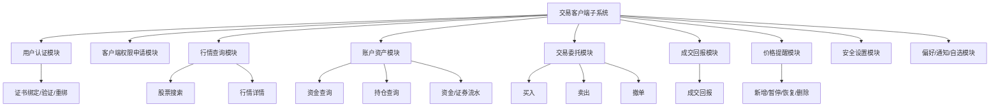

## 3.4 技术介绍

| 层次 | 技术 | 说明 |
|---|---|---|
| 前端框架 | Vue 3 + Vite | 单页应用，开发体验好 |
| 前端路由 | Vue Router | 页面导航和登录守卫 |
| 状态管理 | Pinia 或自定义 reactive store | 管理资金、持仓、行情、委托等状态 |
| HTTP 调用 | fetch / axios | 统一封装请求和错误处理 |
| 证书存储 | IndexedDB | 保存本机私钥 |
| 网关后端 | Node.js CommonJS | 与当前代码一致，便于演进 |
| 客户端数据库 | SQLite + better-sqlite3 | 保存客户端自有数据 |
| 外部服务适配 | Adapters | mock / 真实服务可替换 |
| mock 数据 | JSON 文件 | 本地独立运行和测试 |
| 实时结果 | 当前 HTTP 轮询，后续 WebSocket | 通过 ResultChannel 抽象兼容 |

## 3.5 部署图

### 3.5.1 本地开发模式

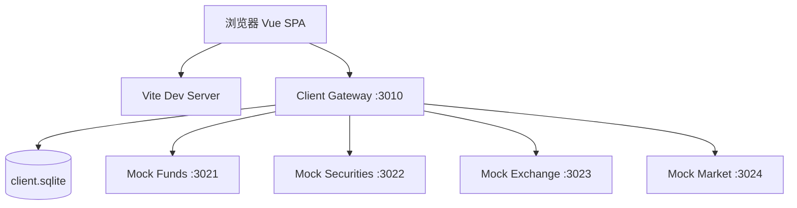

### 3.5.2 联调模式

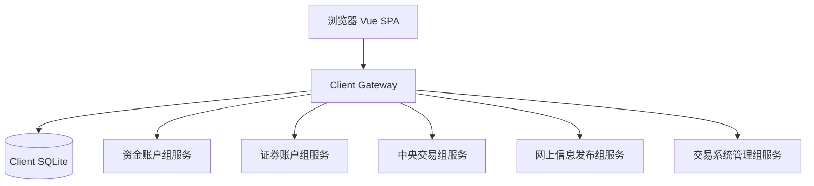

两种模式下，前端只需要配置：

```env
VITE_CLIENT_API_BASE=http://localhost:3010/api
```

联调时仅修改网关侧：

```env
FUNDS_SERVICE_BASE_URL=http://资金账户服务地址
SECURITIES_SERVICE_BASE_URL=http://证券账户服务地址
EXCHANGE_SERVICE_BASE_URL=http://中央交易服务地址
MARKET_SERVICE_BASE_URL=http://行情服务地址
MANAGEMENT_SERVICE_BASE_URL=http://管理服务地址
API_PROFILE=integration
```

## 3.6 类图

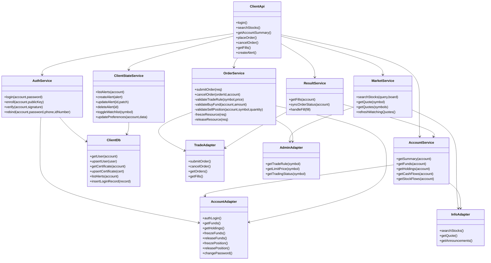

### 3.6.1 总体数据流


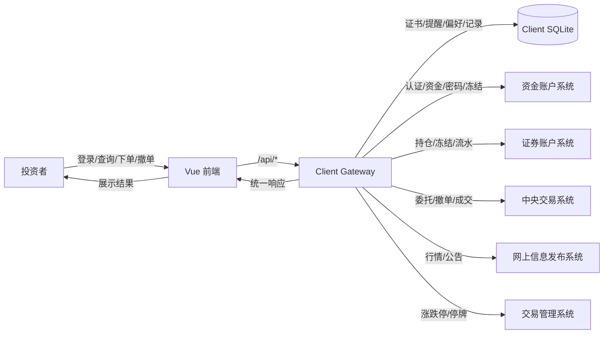

---

## 3.7 接口设计

### 3.7.1 接口设计原则

1. 前端只调用 Client Gateway 的 `/api/*`，不直接调用其他小组子系统；
2. Client Gateway 内部通过 Adapter 调用 ACCOUNT、TRADE、INFO、ADMIN 等外部接口；
3. 前端—网关接口保留当前实现风格，以保证现有用户界面和代码结构稳定；
4. 网关—外部系统接口采用原设计报告中与其他小组约定的 `/api/v1/*` 版本；
5. Adapter 负责 mock 接口、真实接口之间的字段映射和错误码映射；
6. 所有写操作建议支持 `X-Idempotency-Key`，避免重复下单、重复冻结和重复撤单。

### 3.7.2 内部接口

内部接口指交易客户端子系统内部服务之间的调用接口。

| 模块 | 方法 | 输入 | 输出 | 说明 |
|---|---|---|---|---|
| AuthService | login | account, password | LoginAction | 登录并返回 apply/enroll/verify/success |
| AuthService | enroll | account, publicKey | LoginResult | 绑定证书 |
| AuthService | verify | account, signature | LoginResult | 证书挑战验证 |
| AuthService | rebind | account, password, phone, idNumber | Result | 重绑证书 |
| MarketService | searchStocks | query, board | StockList | 股票搜索 |
| MarketService | getQuote | symbol | StockQuote | 单只股票行情 |
| AccountService | getSummary | account | AccountSummary | 资产摘要 |
| AccountService | getHoldings | account | Holding[] | 持仓查询 |
| OrderService | submitOrder | OrderRequest | OrderResult | 提交买入/卖出委托 |
| OrderService | cancelOrder | orderId, account | CancelResult | 撤销委托 |
| ResultService | getFills | account | Fill[] | 查询成交回报 |
| ClientStateService | createAlert | AlertForm | Alert | 新增价格提醒 |
| ClientStateService | updatePreferences | account, data | Result | 更新偏好设置 |

### 3.7.3 前端—Client Gateway 接口

该接口服务于交易客户端前端页面，是本子系统内部接口，不作为与其他小组约定的外部接口。

| 方法 | 路径 | 功能 |
|---|---|---|
| POST | `/api/auth/login` | 登录，返回登录动作 |
| POST | `/api/auth/enroll` | 证书绑定 |
| POST | `/api/auth/verify` | 证书验证 |
| POST | `/api/auth/rebind` | 证书重绑 |
| GET | `/api/auth/me` | 当前用户信息 |
| POST | `/api/client/applications` | 客户端权限申请 |
| GET | `/api/client/applications` | 查询申请记录 |
| GET | `/api/account/summary` | 资产摘要 |
| GET | `/api/account/funds` | 资金余额 |
| GET | `/api/account/holdings` | 持仓 |
| GET | `/api/account/cash-flows` | 资金流水 |
| GET | `/api/account/stock-flows` | 证券流水 |
| POST | `/api/account/funds/deposit` | 存款 |
| POST | `/api/account/funds/withdraw` | 取款 |
| POST | `/api/account/passwords/trade` | 修改交易密码 |
| POST | `/api/account/passwords/withdraw` | 修改取款密码 |
| GET | `/api/market/stocks` | 行情列表/搜索 |
| GET | `/api/market/quotes` | 批量报价 |
| GET | `/api/trade/orders` | 委托列表 |
| POST | `/api/trade/orders` | 提交委托 |
| POST | `/api/trade/orders/:id/cancel` | 撤单 |
| GET | `/api/trade/fills` | 成交回报 |
| GET | `/api/client/alerts` | 提醒列表 |
| POST | `/api/client/alerts` | 新增提醒 |
| PATCH | `/api/client/alerts/:id` | 更新提醒 |
| DELETE | `/api/client/alerts/:id` | 删除提醒 |
| GET | `/api/client/watchlist` | 自选股 |
| POST | `/api/client/watchlist/:symbol/toggle` | 切换自选 |
| GET | `/api/client/preferences` | 偏好设置 |
| PATCH | `/api/client/preferences` | 更新偏好 |
| GET | `/api/client/login-records` | 登录记录 |

### 3.7.4 外部接口

外部接口指 Client Gateway 调用其他小组子系统的接口。该部分采用原设计报告中与其他小组约定的 `/api/v1/*` 版本，不采用当前代码中的 mock 路径作为最终联调接口。

#### 3.7.4.1 ACCOUNT 账户业务接口

| 方法 | 路径 | 功能 | 调用模块 |
|---|---|---|---|
| POST | `/api/v1/account/auth/login` | 资金账户卡号/账户 + 交易密码认证 | AuthService |
| POST | `/api/v1/account/auth/certificate/verify` | 首次登录安全证书认证 | AuthService |
| POST | `/api/v1/account/password/trade` | 修改交易密码 | SettingsService |
| POST | `/api/v1/account/password/withdraw` | 修改取款密码 | SettingsService |
| GET | `/api/v1/account/fund-accounts/{fund_account_id}` | 查询资金账户余额 | AccountService / OrderService |
| POST | `/api/v1/account/fund-accounts/{fund_account_id}/freeze` | 冻结买入资金 | OrderService |
| POST | `/api/v1/account/fund-accounts/{fund_account_id}/release` | 释放冻结资金 | OrderService |
| POST | `/api/v1/account/fund-accounts/{fund_account_id}/deposit` | 存款 | AccountService |
| POST | `/api/v1/account/fund-accounts/{fund_account_id}/withdraw` | 取款 | AccountService |
| GET | `/api/v1/account/fund-accounts/{fund_account_id}/cash-flows` | 查询资金流水 | AccountService |
| GET | `/api/v1/account/security-accounts/{security_account_id}/positions` | 查询证券持仓 | AccountService / OrderService |
| POST | `/api/v1/account/security-accounts/{security_account_id}/positions/freeze` | 冻结卖出持仓 | OrderService |
| POST | `/api/v1/account/security-accounts/{security_account_id}/positions/release` | 释放冻结持仓 | OrderService |
| GET | `/api/v1/account/security-accounts/{security_account_id}/stock-flows` | 查询证券流水 | AccountService |
| GET | `/api/v1/account/associations/check` | 校验资金账户与证券账户关联关系 | AuthService / AccountService |

#### 3.7.4.2 TRADE 中央交易系统接口

| 方法 | 路径 | 功能 | 调用模块 |
|---|---|---|---|
| POST | `/api/v1/trade/orders` | 提交买入/卖出委托 | OrderService |
| GET | `/api/v1/trade/orders` | 查询当前账户委托列表 | OrderService |
| GET | `/api/v1/trade/orders/{order_id}` | 查询单笔委托状态 | OrderService |
| POST | `/api/v1/trade/orders/{order_id}/cancel` | 撤销委托 | OrderService |
| GET | `/api/v1/trade/fills` | 查询成交回报 | ResultService |
| WS | `ws://<trade-host>/api/v1/trade/ws/orders` | 撮合回报推送 | ResultService |
| GET | `/api/v1/trade/market/{stock_code}/best-book` | 查询最优买卖报价 | MarketService / OrderService |

#### 3.7.4.3 INFO 网上信息发布接口

| 方法 | 路径 | 功能 | 调用模块 |
|---|---|---|---|
| GET | `/api/v1/info/stocks` | 股票列表、名称/代码搜索 | MarketService |
| GET | `/api/v1/info/stocks/{stock_code}` | 查询单只股票详情 | MarketService |
| GET | `/api/v1/info/stocks/{stock_code}/quote` | 查询最新行情 | MarketService |
| GET | `/api/v1/info/stocks/quotes` | 批量查询行情 | MarketService |
| GET | `/api/v1/info/stocks/{stock_code}/announcements` | 查询股票公告 | MarketService |
| GET | `/api/v1/info/stocks/{stock_code}/stats` | 查询日/周/月高低价 | MarketService |

#### 3.7.4.4 ADMIN 交易系统管理接口

| 方法 | 路径 | 功能 | 调用模块 |
|---|---|---|---|
| GET | `/api/v1/admin/stocks/{stock_code}/limit` | 查询当日涨跌停价格 | OrderService / MarketService |
| GET | `/api/v1/admin/stocks/{stock_code}/status` | 查询停牌/复牌/交易状态 | OrderService |
| GET | `/api/v1/admin/stocks/{stock_code}/rule` | 查询股票交易规则 | OrderService |
| GET | `/api/v1/admin/trading-day/status` | 查询交易日和开闭市状态 | OrderService / MarketService |

### 3.7.5 字段与状态约定

| 字段 | 含义 |
|---|---|
| investor_id | 投资者编号 |
| fund_account_id | 资金账户编号 |
| security_account_id | 证券账户编号 |
| stock_code | 股票代码 |
| order_id | 委托编号 |
| order_side | BUY / SELL 或 买入 / 卖出 |
| order_price | 委托价格 |
| order_quantity | 委托数量 |
| filled_quantity | 已成交数量 |
| avg_price | 成交均价 |
| available_amount | 可用资金 |
| frozen_amount | 冻结资金 |
| available_shares | 可卖数量 |
| frozen_shares | 冻结股数 |
| latest_price | 最新成交价 |
| best_bid | 当前最高买价 |
| best_ask | 当前最低卖价 |
| limit_up | 涨停价 |
| limit_down | 跌停价 |
| suspended | 是否停牌 |

委托状态统一为：未成交、部分成交、已成交、已撤单、已过期、已拒绝。提醒状态统一为：监控中、已暂停、已触发。

# 4. 详细设计

## 4.1 用户认证模块

### 4.1.1 模块职责

用户认证模块负责：

1. 账户与交易密码登录；
2. 判断是否已开通客户端权限；
3. 判断是否首次登录或是否已绑定证书；
4. 发起证书绑定或证书挑战验证；
5. 支持证书重绑；
6. 维护登录记录；
7. 返回前端进入下一步所需的登录动作。

### 4.1.2 登录动作

| action | 含义 | 前端处理 |
|---|---|---|
| apply | 未开通客户端权限 | 展示申请面板 |
| enroll | 首次登录或无证书 | 前端生成密钥对并提交公钥 |
| verify | 已绑定证书 | 前端用私钥签名 challenge |
| success | 已完成登录 | 进入首页 |

### 4.1.3 登录顺序图

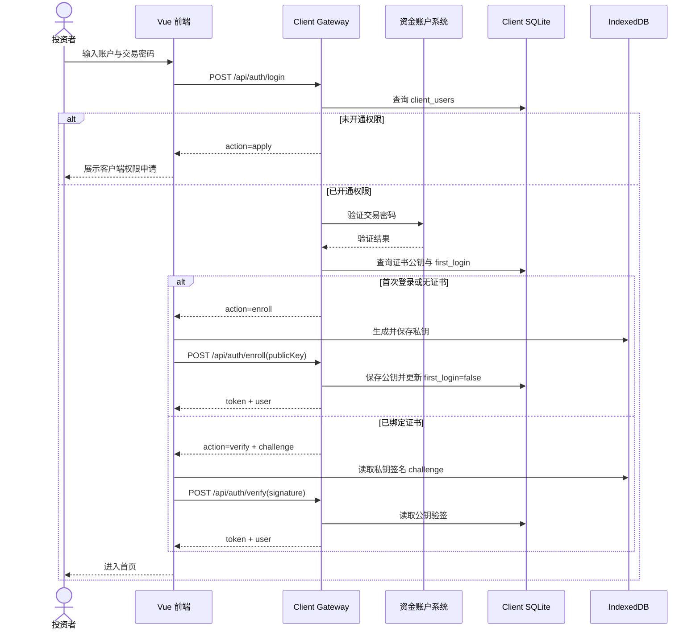

### 4.1.4 登录算法

```text
BEGIN login(account, password)
  IF account/password empty THEN
    RETURN error(COMMON_INVALID_ARGUMENT, "账户与密码不能为空")
  END IF

  user = ClientDb.getUser(account)
  IF user is null THEN
    RETURN { ok:false, action:"apply", message:"未开通客户端权限，请先申请" }
  END IF

  verifyResult = fundsAdapter.verifyTradePassword(account, password)
  IF verifyResult failed THEN
    RETURN error(AUTH_BAD_CREDENTIALS, "交易密码错误")
  END IF

  cert = ClientDb.getCertificate(account)
  IF user.first_login == true OR cert is null THEN
    RETURN { ok:true, action:"enroll" }
  END IF

  challenge = createRandomChallenge(account)
  RETURN { ok:true, action:"verify", challenge }
END
```

## 4.2 客户端权限申请模块

### 4.2.1 模块职责

客户端权限申请用于解决“资金账户已存在，但尚未开通交易客户端使用权限”的场景。用户登录时如果网关未在 client_users 中发现账户，则返回 `action=apply`，前端展示申请表单。

### 4.2.2 处理流程

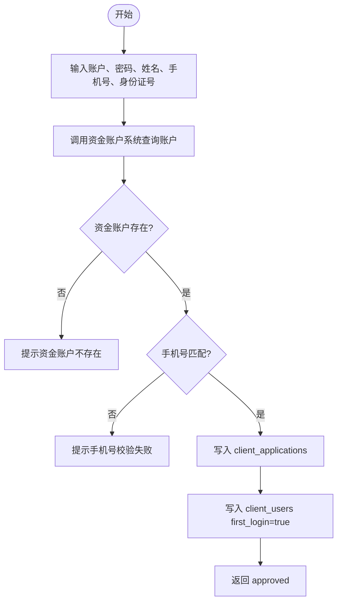

### 4.2.3 设计要求

1. 申请通过后写入 `client_applications`；
2. 申请通过后写入 `client_users`，并将 `first_login` 置为 true；
3. 不允许重复开通同一账户；
4. 密码不应长期明文保存，当前 mock 可保留，最终联调应只保存客户端权限状态，不保存资金账户交易密码。

## 4.3 行情查询模块

### 4.3.1 模块职责

行情查询模块负责：

1. 股票列表查询；
2. 股票代码/名称模糊搜索；
3. 股票详情查询；
4. 批量报价；
5. 行情 5 秒刷新；
6. 为下单模块提供参考价、买一价、卖一价、涨跌停价和停牌状态。

### 4.3.2 行情查询流程

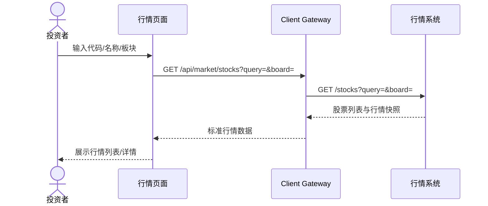

### 4.3.3 行情数据结构

```json
{
  "symbol": "600001",
  "name": "石英系统",
  "board": "主板",
  "lastPrice": 149.17,
  "bid": 149.02,
  "ask": 149.32,
  "dayHigh": 151.20,
  "dayLow": 146.80,
  "weekHigh": 153.00,
  "weekLow": 144.30,
  "monthHigh": 160.20,
  "monthLow": 139.50,
  "limitUp": 164.08,
  "limitDown": 134.25,
  "announcement": "公司公告内容",
  "suspended": false
}
```

说明：当前 mock 行情可暂时不完整，但最终接口模型应向该结构靠拢，以满足实验指导书中对最新价、最优买卖价、日/周/月高低价和公告的要求。

## 4.4 账户资产模块

### 4.4.1 模块职责

账户资产模块负责：

1. 查询资金账户余额；
2. 查询证券账户持仓；
3. 聚合证券市值和总资产；
4. 展示资金流水和证券流水；
5. 计算持仓成本、浮动盈亏和收益率。

### 4.4.2 资产聚合流程

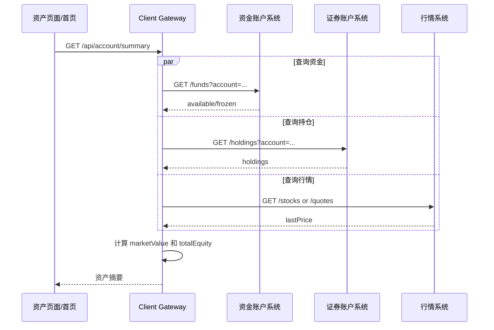

### 4.4.3 持仓成本和盈亏计算

```text
持有成本 = Σ(Pi × Si) / Σ(Si)
持有损益 = (当前价格 - 持有成本) × 当前持仓数量
收益率 = 持有损益 / (持有成本 × 当前持仓数量)
```

其中：

- `Pi` 表示第 i 次买入价格；
- `Si` 表示第 i 次买入数量；
- 当前价格来自行情系统；
- 成本计算以证券账户系统返回的 lots 为准。

## 4.5 交易委托模块

交易委托模块是交易客户端的核心模块，包括买入、卖出、撤单和状态刷新。最终设计要求：

> 前端校验用于用户体验，网关校验用于业务正确性，外部系统校验用于权威确认。

因此，任何买卖委托都不能只依赖前端校验。

## 4.5.1 买入委托流程

### 输入项

| 字段 | 类型 | 约束 |
|---|---|---|
| account | string | 已登录账户 |
| symbol | string | 6 位股票代码 |
| side | enum | 买入 |
| price | decimal | 大于 0，且在涨跌停范围内 |
| quantity | integer | 大于 0，且为 100 的整数倍 |
| note | string | 可选备注 |

### 买入顺序图

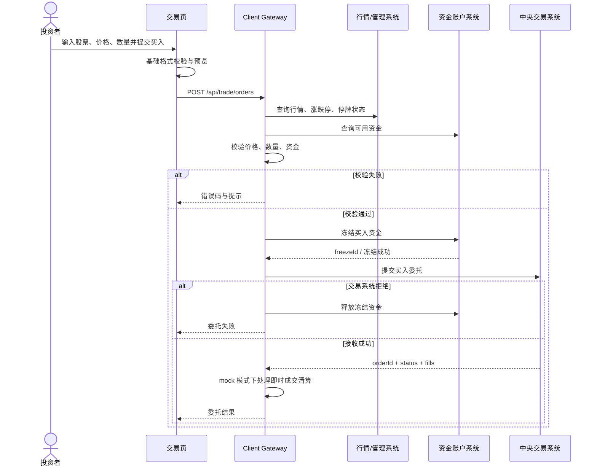

### 买入算法

```text
BEGIN submitBuyOrder(req)
  validateBasic(req.symbol, req.price, req.quantity)
  quote = marketAdapter.getStock(req.symbol)
  rule = managementAdapter.getTradeRule(req.symbol)

  IF rule.suspended THEN
    RETURN error(TRADE_SUSPENDED, "股票暂停交易")
  END IF

  IF req.price < rule.limitDown OR req.price > rule.limitUp THEN
    RETURN error(TRADE_PRICE_OUT_OF_RANGE, "委托价格超出涨跌停范围")
  END IF

  amount = req.price * req.quantity
  fund = fundsAdapter.getFunds(req.account)
  IF fund.available < amount THEN
    RETURN error(ACCOUNT_INSUFFICIENT_FUNDS, "可用资金不足")
  END IF

  freeze = fundsAdapter.freeze(req.account, amount, requestId)
  TRY
    order = exchangeAdapter.placeOrder(req)
  CATCH error
    fundsAdapter.release(req.account, freeze.freezeId)
    RETURN error(TRADE_SUBMIT_FAILED, "委托提交失败，冻结资金已释放")
  END TRY

  IF order.fills not empty THEN
    ResultSyncService.handleFills(order.fills)
  END IF

  RETURN order
END
```

## 4.5.2 卖出委托流程

卖出委托必须校验的是**可卖数量**，而不是简单校验总持仓。可卖数量需要扣除已经提交但尚未成交或撤销的卖出委托冻结数量。

### 可卖数量定义

```text
可卖数量 = 当前持仓数量 - 已冻结卖出数量
```

### 卖出算法

```text
BEGIN submitSellOrder(req)
  validateBasic(req.symbol, req.price, req.quantity)
  quote = marketAdapter.getStock(req.symbol)
  rule = managementAdapter.getTradeRule(req.symbol)

  IF rule.suspended THEN
    RETURN error(TRADE_SUSPENDED, "股票暂停交易")
  END IF

  IF req.price < rule.limitDown OR req.price > rule.limitUp THEN
    RETURN error(TRADE_PRICE_OUT_OF_RANGE, "委托价格超出涨跌停范围")
  END IF

  holding = securitiesAdapter.getHolding(req.account, req.symbol)
  IF holding.availableShares < req.quantity THEN
    RETURN error(ACCOUNT_INSUFFICIENT_POSITION, "可卖数量不足")
  END IF

  freeze = securitiesAdapter.freeze(req.account, req.symbol, req.quantity, requestId)
  TRY
    order = exchangeAdapter.placeOrder(req)
  CATCH error
    securitiesAdapter.release(req.account, freeze.freezeId)
    RETURN error(TRADE_SUBMIT_FAILED, "委托提交失败，冻结持仓已释放")
  END TRY

  IF order.fills not empty THEN
    ResultSyncService.handleFills(order.fills)
  END IF

  RETURN order
END
```

## 4.5.3 撤单流程

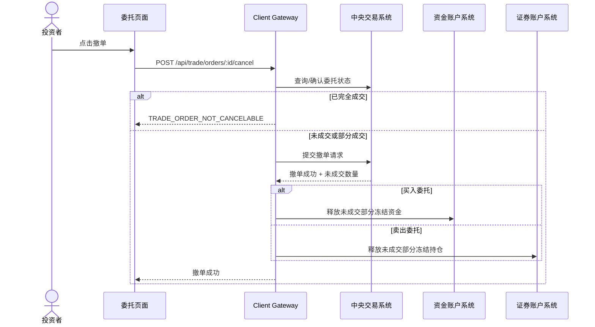

### 撤单规则

| 委托状态 | 是否可撤 | 处理 |
|---|---|---|
| 未成交 | 可撤 | 撤销全部数量，释放全部冻结资源 |
| 部分成交 | 可撤 | 撤销未成交部分，释放剩余冻结资源 |
| 已成交 | 不可撤 | 返回错误提示 |
| 已撤单 | 不可重复撤 | 返回当前状态 |
| 已拒绝 | 不可撤 | 返回当前状态 |
| 已过期 | 不可撤 | 返回当前状态 |

## 4.6 成交回报模块

### 4.6.1 模块定位

成交回报模块负责让用户看到中央交易系统的成交结果，并触发账户刷新。最终设计将“成交回报来源”抽象为 `ResultChannel`：

```text
ResultChannel
├── PollingResultChannel：当前实现，调用 GET /api/trade/fills
└── WebSocketResultChannel：后续升级，连接中央交易系统 WebSocket
```

### 4.6.2 当前实现模式

当前采用 HTTP 查询方式：

1. 前端打开首页或委托成交页面；
2. 前端调用 `/api/trade/fills`；
3. 网关通过 exchangeAdapter 查询成交回报；
4. 页面展示成交回报列表；
5. 下单或撤单后主动刷新资金、持仓、委托和成交。

### 4.6.3 后续升级模式

后续若中央交易系统提供 WebSocket，则可增加：

```text
GET /api/trade/fills        保留，用于历史成交查询
WS  /api/trade/result-ws    新增，用于实时成交推送
```

前端页面不需要重写，只需要将成交回报 store 的数据源从 PollingResultChannel 切换为 WebSocketResultChannel。

### 4.6.4 mock 模式清算说明

在真实系统中，成交后的资金扣减、资金增加、持仓增加、持仓减少应由资金账户系统和证券账户系统根据中央交易系统成交结果完成。当前 mock 模式下，为了让客户端独立跑通，Client Gateway 在收到 mock exchange 返回的 fills 后，主动调用 mock funds 和 mock securities 的 `apply-fill` 接口模拟清算。

最终设计规定：

- **mock 模式：** 网关可以编排模拟清算；
- **真实联调模式：** 网关不应私自修改资金和持仓，只负责提交委托、接收成交回报、刷新外部系统的权威数据。

## 4.7 价格提醒模块

### 4.7.1 模块职责

价格提醒模块负责：

1. 新增提醒；
2. 暂停提醒；
3. 恢复提醒；
4. 删除提醒；
5. 行情刷新时检查触发条件；
6. 触发后更新状态并写入通知。

### 4.7.2 提醒触发流程

```mermaid
flowchart TD
    Start([行情刷新]) --> GetAlerts[读取监控中的提醒]
    GetAlerts --> Loop[逐条读取股票当前价]
    Loop --> Check{满足触发条件?}
    Check -- 否 --> Keep[保持监控中]
    Check -- 是 --> Trigger[更新为已触发]
    Trigger --> Notify[写入通知]
    Notify --> Show[前端展示提醒]
```

### 4.7.3 触发条件

| condition | 触发规则 |
|---|---|
| 高于 | currentPrice >= triggerPrice |
| 低于 | currentPrice <= triggerPrice |

## 4.8 安全设置模块

安全设置模块包括：

1. 修改交易密码；
2. 修改取款密码；
3. 查看登录记录；
4. 查看证书状态；
5. 证书重绑。

密码修改流程由资金账户系统负责，客户端只负责表单提交、错误提示和成功后刷新状态。

## 4.9 状态图设计补充

### 4.9.1 用户登录状态图

```mermaid
stateDiagram-v2
    [*] --> 未登录
    未登录 --> 正在验证: 输入账户密码
    正在验证 --> 未开通权限: 未找到客户端权限
    未开通权限 --> 申请中: 提交申请
    申请中 --> 待绑定证书: 申请通过
    正在验证 --> 待绑定证书: 首次登录/无证书
    正在验证 --> 待证书验证: 已有证书
    待绑定证书 --> 已登录: 证书绑定成功
    待证书验证 --> 已登录: 验签成功
    待证书验证 --> 未登录: 验签失败
    正在验证 --> 未登录: 密码错误
    已登录 --> 未登录: 退出登录
```

### 4.9.2 行情查询状态图

```mermaid
stateDiagram-v2
    [*] --> 无查询
    无查询 --> 查询中: 输入代码/名称
    查询中 --> 展示行情: 查询成功
    查询中 --> 查询失败: 股票不存在/服务异常
    展示行情 --> 刷新中: 自动或手动刷新
    刷新中 --> 展示行情: 刷新成功
    刷新中 --> 数据延迟: 刷新失败但存在缓存
    数据延迟 --> 刷新中: 再次刷新
    展示行情 --> 无查询: 清空查询
```

### 4.9.3 委托状态图

```mermaid
stateDiagram-v2
    [*] --> 待提交
    待提交 --> 校验中: 点击提交
    校验中 --> 已拒绝: 参数/资金/持仓/价格校验失败
    校验中 --> 已提交: 校验通过并提交交易系统
    已提交 --> 部分成交: 收到部分成交回报
    已提交 --> 已成交: 收到完全成交回报
    已提交 --> 已撤单: 用户撤单成功
    已提交 --> 已过期: 当日结束未成交
    部分成交 --> 已成交: 剩余继续成交
    部分成交 --> 已撤单: 撤销剩余未成交部分
    部分成交 --> 已过期: 剩余部分日终过期
    已拒绝 --> [*]
    已成交 --> [*]
    已撤单 --> [*]
    已过期 --> [*]
```

### 4.9.4 价格提醒状态图

```mermaid
stateDiagram-v2
    [*] --> 未设置
    未设置 --> 监控中: 新增提醒
    监控中 --> 已暂停: 暂停提醒
    已暂停 --> 监控中: 恢复提醒
    监控中 --> 已触发: 价格达到阈值
    已触发 --> 监控中: 用户选择继续监听
    已触发 --> 未设置: 删除提醒
    已暂停 --> 未设置: 删除提醒
```

# 

# 5. 用户界面

## 5.1 界面总体布局

系统采用后台式单页应用布局：

- 顶部栏：显示系统名称、当前登录用户、刷新状态、退出登录；
- 左侧导航：工作台、行情中心、交易下单、委托成交、资产流水、价格提醒、安全设置；
- 主内容区：根据路由展示不同页面；
- 全局提示区：展示错误、成功、成交提醒、价格提醒。

## 5.2 页面设计

| 页面 | 主要功能 | 主要接口 |
|---|---|---|
| LoginView | 登录、权限申请、证书绑定、证书验证、证书重绑 | `/auth/login`、`/auth/enroll`、`/auth/verify`、`/auth/rebind`、`/client/applications` |
| DashboardView | 资金摘要、持仓摘要、最新委托、最新成交、提醒摘要 | `/account/funds`、`/account/holdings`、`/trade/orders`、`/trade/fills`、`/client/alerts` |
| MarketView | 股票搜索、行情列表、股票详情、跳转买入/卖出/提醒 | `/market/stocks`、`/market/quotes` |
| TradeView | 买入/卖出切换、委托预览、提交委托 | `/trade/orders`、`/account/funds`、`/account/holdings`、`/market/stocks` |
| OrdersView | 委托列表、状态筛选、撤单、成交回报 | `/trade/orders`、`/trade/fills`、`/trade/orders/:id/cancel` |
| AccountView | 资金、持仓、资金流水、证券流水、存取款 | `/account/funds`、`/account/holdings`、`/account/cash-flows`、`/account/stock-flows` |
| AlertsView | 新增、暂停、恢复、删除价格提醒 | `/client/alerts` |
| SettingsView | 修改交易密码、修改取款密码、登录记录、证书状态 | `/account/passwords/trade`、`/account/passwords/withdraw`、`/client/login-records` |

整体前端样式采用统一的Swiss极简风格，下为图示（按顺序）：


## 5.3 组件设计

| 组件 | 职责 |
|---|---|
| AppShell | 页面整体框架，组织顶部栏、侧边栏和主内容区 |
| TopBar | 当前用户、刷新按钮、退出按钮、连接状态展示 |
| SidebarNav | 主要功能导航 |
| StatCard | 首页和资产页统计卡片 |
| FundsSummary | 展示可用资金、冻结资金、证券市值、总资产 |
| HoldingsTable | 展示持仓、成本、盈亏、可卖数量 |
| MarketTable | 展示股票行情列表 |
| StockSearchPanel | 股票搜索与筛选 |
| StockDetailCard | 展示单只股票详情、买一卖一、涨跌停、公告 |
| TradeTicket | 买入/卖出委托输入和预览 |
| OrderListTable | 展示委托、状态、撤单按钮 |
| AlertsList | 展示价格提醒和操作按钮 |
| PriceTicker | 展示行情滚动或重点报价 |

## 5.4 交互状态设计

每个页面至少包含以下状态：

| 状态 | 表现 |
|---|---|
| loading | 显示加载中，禁用重复提交 |
| empty | 显示空状态提示，例如“暂无持仓” |
| error | 显示错误信息和重试按钮 |
| stale | 行情或资产加载失败时展示上次数据，并标记“数据可能延迟” |
| success | 操作成功后显示提示，并刷新相关数据 |

## 5.5 下单页面交互规则

1. 选择买入时，默认价格可填入卖一价或最新价；
2. 选择卖出时，默认价格可填入买一价或最新价；
3. 输入数量必须为 100 的整数倍；
4. 输入价格超过涨跌停时前端立即提示；
5. 买入时展示预计占用资金；
6. 卖出时展示可卖数量；
7. 提交前展示委托预览；
8. 提交后刷新资金、持仓、委托和成交回报。

---

# 6. 数据库设计

## 6.1 数据归属原则

最终设计坚持以下原则：

> 客户端只保存客户端自有数据，不保存资金、持仓、委托、成交、行情等权威业务数据。

## 6.2 概念结构设计

```mermaid
erDiagram
    CLIENT_USER ||--o{ CLIENT_CERTIFICATE : has
    CLIENT_USER ||--o{ CLIENT_APPLICATION : submits
    CLIENT_USER ||--o{ CLIENT_LOGIN_RECORD : produces
    CLIENT_USER ||--o{ CLIENT_ALERT : owns
    CLIENT_USER ||--o{ CLIENT_NOTIFICATION : receives
    CLIENT_USER ||--o{ CLIENT_WATCHLIST : watches
    CLIENT_USER ||--|| CLIENT_PREFERENCES : configures

    CLIENT_USER {
        int id PK
        string account UK
        string name
        string phone
        string id_number
        int first_login
    }

    CLIENT_CERTIFICATE {
        int id PK
        string account FK
        text public_key
        string updated_at
    }

    CLIENT_APPLICATION {
        int id PK
        string account FK
        string type
        string status
        string created_at
    }

    CLIENT_LOGIN_RECORD {
        int id PK
        string account FK
        string time
        string method
        string device
        string status
    }

    CLIENT_ALERT {
        int id PK
        string account FK
        string symbol
        string condition
        string trigger_price
        string current_price
        string status
        string last_triggered
        string created_at
        string updated_at
    }

    CLIENT_NOTIFICATION {
        int id PK
        string account FK
        string title
        string content
        int read
        string created_at
    }

    CLIENT_PREFERENCES {
        string account PK
        text data
    }

    CLIENT_WATCHLIST {
        int id PK
        string account FK
        string symbol
    }
```

## 6.3 SQLite 逻辑结构设计

| 表名 | 用途 |
|---|---|
| client_users | 客户端准入账户、用户姓名、首次登录标记 |
| client_certificates | 账户绑定的证书公钥 |
| client_sessions | 会话记录，当前可选，后续可用于 refresh token |
| client_login_records | 登录记录 |
| client_applications | 客户端权限申请记录 |
| client_alerts | 价格提醒 |
| client_notifications | 通知消息 |
| client_preferences | 用户偏好配置 |
| client_watchlist | 自选股 |

## 6.4 SQLite 物理结构设计

### 6.4.1 client_users

| 字段 | 类型 | 约束 | 说明 |
|---|---|---|---|
| id | INTEGER | PK AUTOINCREMENT | 主键 |
| account | TEXT | UNIQUE NOT NULL | 账户 |
| password | TEXT | NOT NULL | 当前 mock 保留；正式联调不建议保存交易密码 |
| name | TEXT |  | 姓名 |
| phone | TEXT |  | 手机号 |
| id_number | TEXT |  | 身份证号 |
| first_login | INTEGER | DEFAULT 1 | 是否首次登录 |

### 6.4.2 client_certificates

| 字段 | 类型 | 约束 | 说明 |
|---|---|---|---|
| id | INTEGER | PK AUTOINCREMENT | 主键 |
| account | TEXT | NOT NULL | 账户 |
| public_key | TEXT |  | JWK 格式公钥 |
| updated_at | TEXT |  | 更新时间 |

### 6.4.3 client_alerts

| 字段 | 类型 | 约束 | 说明 |
|---|---|---|---|
| id | INTEGER | PK AUTOINCREMENT | 主键 |
| account | TEXT | NOT NULL | 账户 |
| symbol | TEXT | NOT NULL | 股票代码 |
| condition | TEXT | NOT NULL | 高于 / 低于 |
| trigger_price | TEXT | NOT NULL | 触发价格 |
| current_price | TEXT |  | 当前价格 |
| status | TEXT |  | 监控中 / 已暂停 / 已触发 |
| last_triggered | TEXT |  | 最后触发时间 |
| created_at | TEXT |  | 创建时间 |
| updated_at | TEXT |  | 更新时间 |

### 6.4.4 其他表

| 表 | 关键字段 | 说明 |
|---|---|---|
| client_login_records | account、time、method、device、status | 记录登录行为 |
| client_applications | account、type、status、created_at | 记录客户端权限申请 |
| client_notifications | account、title、content、read、created_at | 通知消息 |
| client_preferences | account、data | JSON 字符串保存偏好 |
| client_watchlist | account、symbol | 自选股 |

## 6.5 外部业务数据模型（模拟后端简易版）

### 6.5.1 资金账户数据

```json
{
  "account": "admin",
  "fundAccountId": "CASH-20001",
  "currency": "CNY",
  "available": 200000,
  "frozen": 0,
  "marketValue": 14853,
  "totalEquity": 214853,
  "updatedAt": "2026-05-30T04:19:47.321+08:00"
}
```

### 6.5.2 持仓数据

```json
{
  "symbol": "600001",
  "name": "石英系统",
  "shares": 200,
  "availableShares": 200,
  "frozenShares": 0,
  "costPrice": 150.04,
  "lastPrice": 148.53,
  "pnlAmount": -302,
  "pnlRate": -0.01
}
```

### 6.5.3 委托数据

```json
{
  "id": "ORD-...",
  "createdAt": "2026/5/30 04:16:18",
  "account": "admin",
  "symbol": "600001",
  "side": "买入",
  "price": 150.51,
  "quantity": 100,
  "filledQuantity": 100,
  "avgPrice": 150.47,
  "status": "已成交"
}
```

### 6.5.4 成交回报数据

```json
{
  "id": "FILL-...",
  "createdAt": "2026/5/30 04:16:18",
  "orderId": "ORD-...",
  "symbol": "600001",
  "side": "买入",
  "price": 150.47,
  "quantity": 100
}
```

---

# 7. 运行设计

## 7.1 运行模式

系统支持两种运行模式：

| 模式 | 用途 | 外部服务来源 |
|---|---|---|
| mock | 独立开发、演示、测试 | 本地 mock funds / securities / exchange / market |
| integration | 与其他组联调 | 其他组真实服务 |

## 7.2 mock 模式启动步骤

1. 安装依赖：

```bash
npm install
```

2. 启动客户端网关与 mock 服务：

```cmd
.\start-gateway.cmd
```

3. 启动前端：

```cmd
npm run dev
```

4. 访问 Vite 输出地址，通常为：

```text
http://localhost:5173
```

## 7.3 环境变量

```env
VITE_CLIENT_API_BASE=http://localhost:3010/api
API_PROFILE=mock
CLIENT_API_PORT=3010
FUNDS_SERVICE_BASE_URL=http://localhost:3021
SECURITIES_SERVICE_BASE_URL=http://localhost:3022
EXCHANGE_SERVICE_BASE_URL=http://localhost:3023
MARKET_SERVICE_BASE_URL=http://localhost:3024
MANAGEMENT_SERVICE_BASE_URL=http://localhost:3025
```

## 7.4 典型运行流程

### 7.4.1 登录流程

1. 用户输入账户和交易密码；
2. 若未开通权限，进入申请流程；
3. 若首次登录，绑定本机证书；
4. 若已有证书，进行 challenge 签名验证；
5. 验证成功后进入首页。

### 7.4.2 行情流程

1. 用户进入行情中心；
2. 前端调用 `/api/market/stocks`；
3. 网关调用 marketAdapter；
4. 行情服务返回列表或详情；
5. 前端展示行情，并支持跳转买入、卖出、提醒。

### 7.4.3 买入流程

1. 用户输入股票代码、价格、数量；
2. 前端进行基础校验；
3. 网关进行权威前置校验；
4. 资金账户系统冻结资金；
5. 中央交易系统接收委托；
6. 若产生成交，刷新资金、持仓、委托、成交。

### 7.4.4 卖出流程

1. 用户选择持仓或输入股票代码；
2. 输入价格和数量；
3. 前端提示可卖数量；
4. 网关校验可卖数量；
5. 证券账户系统冻结持仓；
6. 中央交易系统接收委托；
7. 若产生成交，刷新资金、持仓、委托、成交。

### 7.4.5 撤单流程

1. 用户在委托列表点击撤单；
2. 网关确认委托状态；
3. 中央交易系统撤销未成交部分；
4. 买入委托释放冻结资金，卖出委托释放冻结持仓；
5. 刷新委托和资产。

## 7.5 联调运行设计

联调时遵循以下规则：

1. 前端不改接口地址，只调用 Client Gateway；
2. 网关 adapters 替换为真实服务 base URL；
3. 网关负责字段转换，例如将其他组的字段转换为前端统一字段；
4. 若真实服务暂缺某接口，可在 adapter 中临时兼容，不污染前端；
5. 所有联调问题优先定位在 adapter 层，避免页面层频繁变更。

## 7.6 测试设计

| 测试类别 | 测试内容 |
|---|---|
| 登录测试 | 未开通权限、首次登录、证书验证、证书重绑、错误密码 |
| 行情测试 | 搜索、详情、刷新、无结果、行情服务失败 |
| 资金测试 | 资金查询、存款、取款、取款密码错误、余额不足 |
| 持仓测试 | 空持仓、有持仓、成本和盈亏计算 |
| 买入测试 | 正常买入、资金不足、价格越界、数量非法、股票不存在 |
| 卖出测试 | 正常卖出、持仓不足、重复卖出、价格越界 |
| 撤单测试 | 未成交撤单、部分成交撤单、已成交撤单失败 |
| 成交测试 | 成交回报展示、成交后资金持仓刷新 |
| 提醒测试 | 新增、暂停、恢复、删除、触发提醒 |
| 联调测试 | adapters 切换真实接口后核心页面不改动 |

---

# 8. 系统出错设计

## 8.1 错误码设计

| 错误码 | 含义 | 前端处理 |
|---|---|---|
| COMMON_INVALID_ARGUMENT | 参数不合法 | 提示用户修改输入 |
| COMMON_UNAUTHORIZED | 未登录或登录失效 | 跳转登录页 |
| COMMON_NOT_FOUND | 资源不存在 | 提示不存在 |
| AUTH_BAD_CREDENTIALS | 账户或交易密码错误 | 提示重新输入 |
| AUTH_CERT_REQUIRED | 需要绑定证书 | 进入证书绑定流程 |
| AUTH_CERT_INVALID | 证书验证失败 | 提示重试或重绑 |
| CLIENT_ACCESS_REQUIRED | 未开通客户端权限 | 展示申请面板 |
| ACCOUNT_INSUFFICIENT_FUNDS | 可用资金不足 | 提示当前可用资金 |
| ACCOUNT_INSUFFICIENT_POSITION | 可卖数量不足 | 提示当前可卖数量 |
| ACCOUNT_WITHDRAW_PASSWORD_ERROR | 取款密码错误 | 提示重新输入 |
| TRADE_PRICE_OUT_OF_RANGE | 委托价格超出涨跌停 | 提示涨跌停范围 |
| TRADE_INVALID_QUANTITY | 委托数量非法 | 提示 100 股整数倍 |
| TRADE_SUSPENDED | 股票停牌 | 禁止提交 |
| TRADE_ORDER_NOT_CANCELABLE | 当前委托不可撤销 | 刷新委托状态 |
| TRADE_SUBMIT_FAILED | 委托提交失败 | 提示失败原因，释放冻结资源 |
| EXTERNAL_SERVICE_ERROR | 外部服务异常 | 展示重试按钮 |
| MARKET_DATA_STALE | 行情数据延迟 | 标记数据可能延迟 |

## 8.2 出错处理原则

1. 前端必须展示用户可理解的错误提示；
2. 网关必须保留错误码和原始服务信息，便于排查；
3. 下单过程如果已经冻结资金或持仓，但委托提交失败，必须补偿释放；
4. mock 模式下数据异常可以提示重置 mock 数据；
5. 联调模式下外部服务异常不应导致前端崩溃；
6. 行情失败时允许展示上次缓存数据，但必须提示数据可能延迟。

## 8.3 补救措施

| 场景 | 补救措施 |
|---|---|
| 网关异常 | 重启 Client Gateway，前端提示无法连接服务 |
| mock 服务异常 | 检查对应端口或使用 start-gateway.cmd 重启 |
| SQLite 异常 | 使用 reset-client-db.cmd 重置客户端数据库 |
| 证书验证失败 | 引导用户证书重绑或清理 IndexedDB 后重新绑定 |
| 委托状态异常 | 调用中央交易系统查询真实委托状态 |
| 成交后资金持仓不一致 | mock 模式检查 apply-fill；真实模式以资金/证券系统权威数据为准 |
| 行情异常 | 展示上次数据并提示手动刷新 |

## 8.4 维护设计

1. 网关提供 `/health` 存活检查；
2. 每次写操作记录 requestId、account、接口、耗时和结果；
3. 日志中不得记录密码、私钥、完整 token；
4. adapters 统一处理外部服务错误；
5. 核心流程需要单元测试和集成测试；
6. 下单、撤单、冻结、释放接口需要幂等设计。

---

# 附录 A：功能需求到设计模块映射

| 需求编号 | 需求名称 | 对应设计模块 | 对应页面 |
|---|---|---|---|
| TC001 | 登录客户端 | 用户认证模块 | LoginView |
| TC002 | 修改密码 | 安全设置模块 | SettingsView |
| TC003 | 查询股票信息 | 行情查询模块 | MarketView / StockDetailCard |
| TC004 | 查询持仓信息 | 账户资产模块 | AccountView / HoldingsTable |
| TC005 | 查询资金账户 | 账户资产模块 | DashboardView / FundsSummary |
| TC006 | 发出购买指令 | 交易委托模块 | TradeView / TradeTicket |
| TC007 | 发出出售指令 | 交易委托模块 | TradeView / TradeTicket |
| TC008 | 撤销指令 | 交易委托模块 | OrdersView / OrderListTable |
| TC009 | 显示交易结果 | 成交回报模块 | OrdersView / DashboardView |
| TC010 | 价格提醒 | 价格提醒模块 | AlertsView / AlertsList |

