# 股票交易系统——交易客户端子系统

## 设计说明书（基于当前实现）

**组长：**
 **组员：**
 **日期：** 2026-05-31
 **版本：** 1.1

------

## 目录

1. 文档介绍
2. 项目介绍
3. 总体设计
4. 详细设计
5. 用户界面
6. 数据库设计
7. 运行设计
8. 系统出错设计

------

## 1. 文档介绍

### 1.1 编写目的

本文档以当前实现的项目代码为准，描述股票交易系统交易客户端子系统（CLIENT）的详细设计，目的如下：

1. 定义当前实现的架构与模块划分，为维护与联调提供依据；
2. 明确当前网关与 mock 服务的接口约定，作为调试与测试依据；
3. 记录数据模型、处理逻辑和出错处理，作为评审与验收基础。

### 1.2 文档范围

本文档覆盖当前实现的全部功能模块：

- 登录、证书绑定/验证/重绑、客户端权限申请
- 行情查询与详情、交易下单、撤单、成交回报
- 资金与持仓、资金/证券流水、存取款
- 价格提醒、通知、自选股、偏好设置
- 安全设置（修改交易/取款密码、登录记录）

### 1.3 读者对象

交易客户端前后端开发人员、联调人员、测试人员。

### 1.4 术语与缩写解释

| 缩写 / 术语 | 解释 |
| --- | --- |
| CLIENT | 交易客户端子系统（本子系统） |
| Gateway | 客户端统一网关（Node.js 服务） |
| Mock 服务 | 本地模拟的资金/证券/撮合/行情服务 |
| Client SQLite | 客户端自有 SQLite 数据库（证书、提醒、记录等） |
| IndexedDB | 浏览器端证书存储（公私钥对） |
| 证书验证 | 客户端使用本机私钥签名挑战码完成验证 |

### 1.5 参考资料

| 序号 | 文档名称 | 版本 |
| --- | --- | --- |
| 1 | TradingClient README | 当前 |
| 2 | TradingClient Project Guide | 当前 |
| 3 | TradingClient API Contract | 当前 |
| 4 | Vue 3 官方文档 | 3.x |

------

## 2. 项目介绍

### 2.1 项目说明

- **项目名称：** 股票交易系统——交易客户端子系统
- **任务提出者：** 软件工程课程组
- **开发者：** 第五组
- **用户群：** 持有资金账户的证券投资者

### 2.2 项目背景

交易客户端是投资者侧交互入口，当前实现采用“前端 + 客户端网关 + mock 外部服务”的独立运行方式。前端只调用统一网关 `VITE_CLIENT_API_BASE`，网关负责组合 client SQLite 与 mock 服务数据，使前端在不依赖外部系统的情况下完成联调前测试。

### 2.3 需求概述

#### 2.3.1 功能需求（当前实现）

| 模块 | 功能描述 |
| --- | --- |
| 用户认证 | 资金账户登录、证书绑定/验证、证书重绑、客户端权限申请 |
| 行情查询 | 股票列表、搜索、详情、行情刷新与价格区间展示 |
| 交易操作 | 买入/卖出委托、撤单、成交回报列表 |
| 账户资产 | 资金、持仓、资金/证券流水、存取款 |
| 价格提醒 | 新增/暂停/恢复/删除提醒，触发条件计算 |
| 安全设置 | 修改交易/取款密码、登录记录展示 |
| 用户偏好 | 通知、偏好、自选股等客户端自有数据 |

#### 2.3.2 性能与刷新需求

- 行情数据由 mock 行情服务每 5 秒更新一次；
- 前端支持手动刷新与可选自动刷新；
- 页面操作以本地网络响应为主，无明确并发指标。

#### 2.3.3 安全需求（实现范围）

- 登录需交易密码验证，并进行本机证书绑定/验证；
- 证书私钥存于浏览器 IndexedDB；
- 当前实现为本地调试场景，未配置 HTTPS 与真实 Token 鉴权。

### 2.4 条件与限制

- **后端语言：** Node.js (CommonJS)
- **数据库：** SQLite（客户端自有数据） + JSON 文件（mock 服务）
- **外部系统：** 以 mock 服务模拟资金/证券/撮合/行情
- **通信协议：** HTTP REST；无 WebSocket 实时推送

------

## 3. 总体设计

### 3.1 基本设计概念和流程处理

当前实现采用“前端 + 客户端网关 + mock 服务”架构：

- **前端：** Vue 3 SPA，负责交互与基础校验；
- **网关：** Node.js HTTP 服务，提供统一 `/api/*` 接口；
- **客户端自有数据：** SQLite 存储证书、提醒、登录记录、偏好等；
- **mock 服务：** 模拟资金、证券、撮合、行情，使用 JSON 持久化。

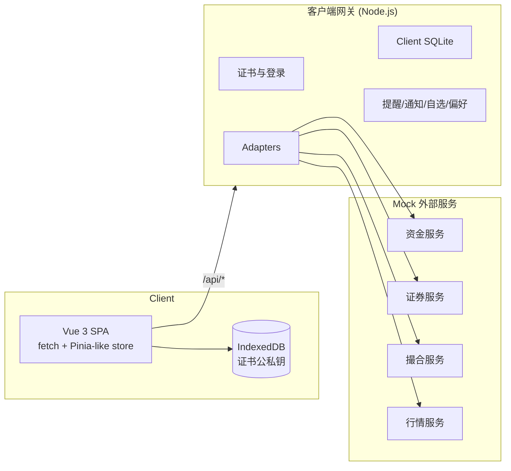

### 3.2 功能 IPO 图

**登录 + 证书认证**

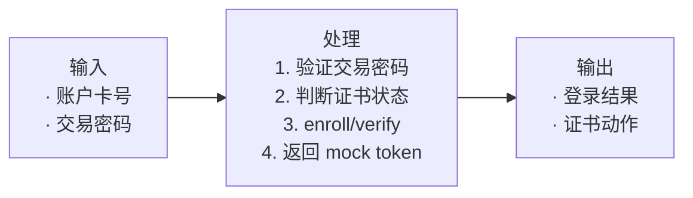

**下单委托**

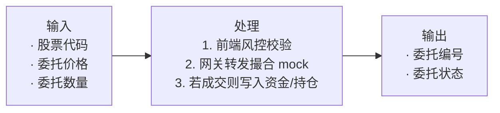

**价格提醒刷新**

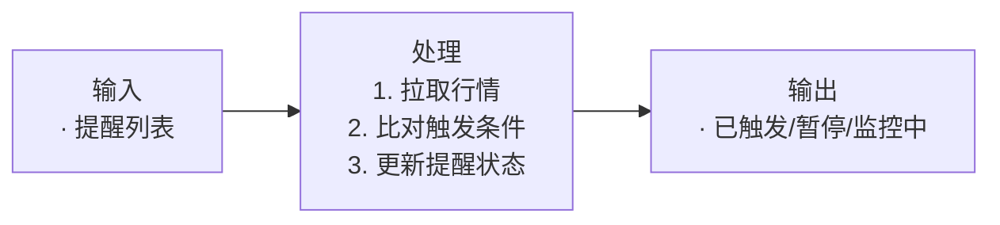

### 3.3 系统结构

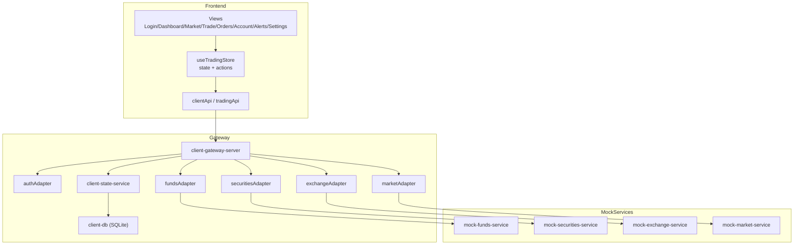

### 3.4 技术介绍

| 层次 | 技术选型 | 说明 |
| --- | --- | --- |
| 前端框架 | Vue 3 + Vite | SPA，组合式 API |
| 状态管理 | 自定义 store + reactive | 统一账户、行情、委托状态 |
| 路由 | Vue Router 4 | 页面路由 |
| HTTP 客户端 | fetch | 基础请求封装 |
| 后端 | Node.js (CJS) | 统一网关 + adapters |
| 数据库 | SQLite | 客户端自有数据 |
| Mock 数据 | JSON 文件 | 资金/证券/撮合/行情 |
| 证书存储 | IndexedDB | 浏览器端公私钥 |

### 3.5 部署图（本地开发）

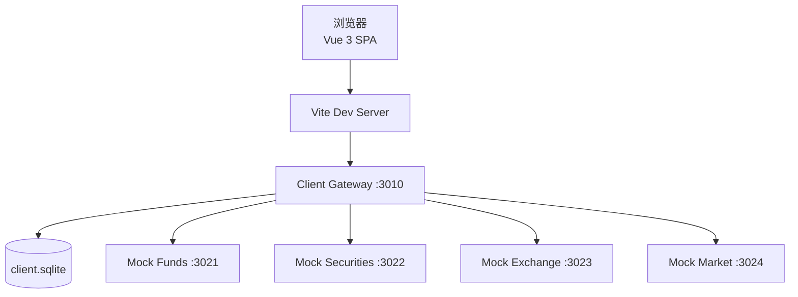

### 3.6 类图（模块级）

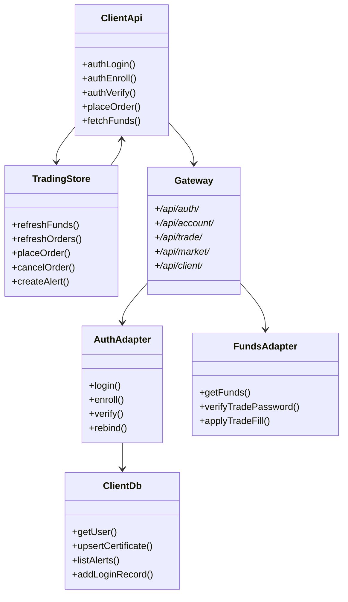

### 3.7 接口设计

统一网关基地址：`/api`（由 `VITE_CLIENT_API_BASE` 指定）

#### 3.7.1 认证与客户端接口

| 方法 | 路径 | 功能 |
| --- | --- | --- |
| POST | `/auth/login` | 登录，返回证书动作 |
| POST | `/auth/enroll` | 证书绑定 |
| POST | `/auth/verify` | 证书验证 |
| POST | `/auth/rebind` | 证书重绑 |
| GET | `/auth/me` | 查询账户信息 |
| POST | `/client/applications` | 申请客户端权限 |
| GET | `/client/applications` | 查询申请记录 |
| GET | `/client/alerts` | 提醒列表 |
| POST | `/client/alerts` | 新增提醒 |
| PATCH | `/client/alerts/:id` | 更新提醒 |
| DELETE | `/client/alerts/:id` | 删除提醒 |
| GET | `/client/login-records` | 登录记录 |
| POST | `/client/login-records` | 写入登录记录 |
| GET | `/client/notifications` | 通知列表 |
| PATCH | `/client/notifications/:id/read` | 标记通知已读 |
| GET | `/client/watchlist` | 自选股 |
| POST | `/client/watchlist/:symbol/toggle` | 切换自选 |
| GET | `/client/preferences` | 偏好 |
| PATCH | `/client/preferences` | 更新偏好 |

#### 3.7.2 账户与交易接口

| 方法 | 路径 | 功能 |
| --- | --- | --- |
| GET | `/account/summary` | 资金 + 市值合并 |
| GET | `/account/funds` | 资金余额 |
| GET | `/account/holdings` | 持仓 |
| GET | `/account/cash-flows` | 资金流水 |
| GET | `/account/stock-flows` | 证券流水 |
| POST | `/account/funds/deposit` | 存款 |
| POST | `/account/funds/withdraw` | 取款 |
| POST | `/account/passwords/trade` | 修改交易密码 |
| POST | `/account/passwords/withdraw` | 修改取款密码 |
| GET | `/trade/orders` | 委托列表 |
| POST | `/trade/orders` | 提交委托 |
| POST | `/trade/orders/:id/cancel` | 撤单 |
| GET | `/trade/fills` | 成交回报 |
| GET | `/market/stocks` | 行情列表/搜索/详情 |
| GET | `/market/quotes` | 行情批量报价 |

------

## 4. 详细设计

### 4.1 顺序图

#### 4.1.1 投资者登录（含申请与证书）

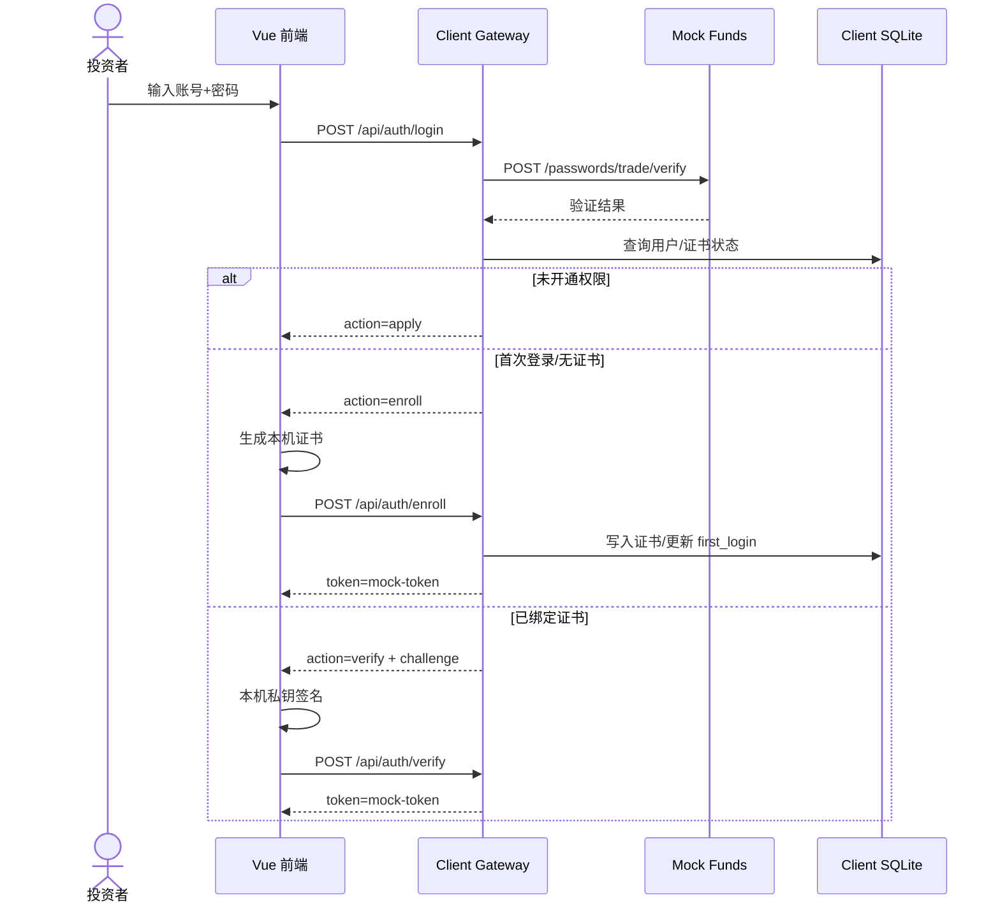

#### 4.1.2 发出买入/卖出委托

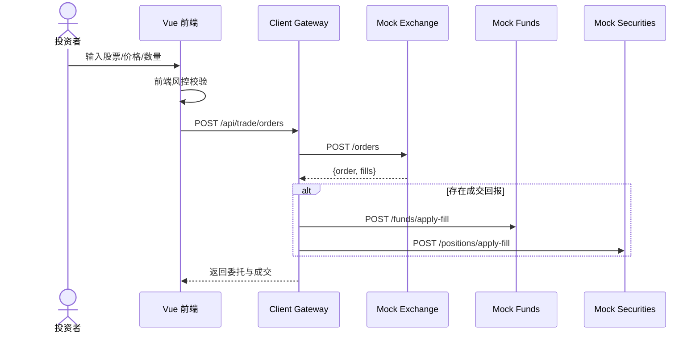

#### 4.1.3 撤销委托

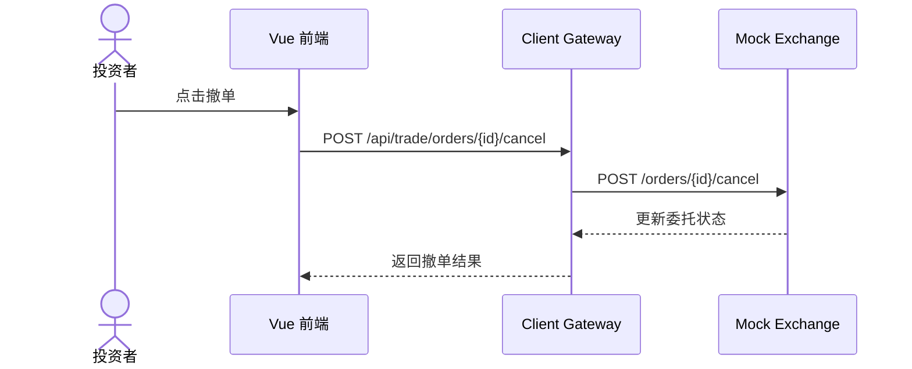

#### 4.1.4 价格提醒刷新

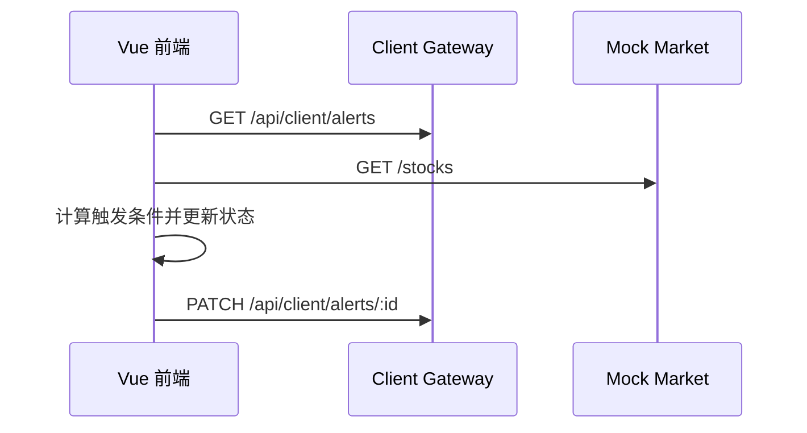

### 4.2 执行概念

#### 4.2.1 用户认证模块

**模块概述**

网关验证交易密码并根据 client SQLite 的证书记录决定登录动作。前端在本机保存公私钥，通过挑战码签名完成验证。

**输入项**

| 名称 | 标识 | 类型 | 说明 |
| --- | --- | --- | --- |
| 账户卡号 | account | string | 投资者标识 |
| 交易密码 | password | string | 用于资金系统校验 |

**输出项**

| 名称 | 标识 | 类型 | 说明 |
| --- | --- | --- | --- |
| 登录动作 | action | string | apply/enroll/verify |
| 令牌 | token | string | mock-token（当前未用于鉴权） |

**设计方法（算法）**

```
BEGIN login(account, password):
  调用 funds /passwords/trade/verify
  IF 账户未开通权限:
    返回 action=apply
  ELSE IF 无证书或首次登录:
    返回 action=enroll
  ELSE:
    返回 action=verify + challenge
END
```

#### 4.2.2 行情查询模块

**模块概述**

前端通过网关请求行情列表或单只股票详情；mock 行情服务每 5 秒更新价格。

**设计方法（算法）**

```
BEGIN get_stocks(query, board):
  GET /api/market/stocks
  返回 stocks 与 asOf
END
```

#### 4.2.3 账户查询模块

**模块概述**

网关聚合资金与持仓，前端展示资金、持仓、流水和资产汇总。

**持仓成本与损益公式**

$$\text{持有成本} = \frac{\sum_{i=1}^{n} P_i \cdot S_i}{\sum_{i=1}^{n} S_i}$$

$$\text{持有损益} = (P_{\text{current}} - \text{持有成本}) \times S_{\text{total}}$$

其中 $P_i$、$S_i$ 来自持仓 lot，$P_{\text{current}}$ 来自行情服务。

#### 4.2.4 下单处理模块

**模块概述**

前端完成价格区间、数量与资金/持仓约束校验，再提交委托。撮合服务可能产生即时成交，网关根据成交回报更新资金与持仓。

**输入项**

| 名称 | 标识 | 类型 | 说明 |
| --- | --- | --- | --- |
| 股票代码 | symbol | string | 6 位数字 |
| 买卖方向 | side | enum | 买入 / 卖出 |
| 委托价格 | price | number | > 0 |
| 委托数量 | quantity | int | 100 的整数倍 |

#### 4.2.5 结果接收模块

当前实现未使用 WebSocket。成交结果通过 `GET /api/trade/fills` 拉取，并在委托/首页页面展示。

------

## 5. 用户界面

### 5.1 登录界面

- 账户卡号与交易密码登录
- 证书状态展示、首次绑定与证书重绑
- 客户端权限申请面板

### 5.2 首页工作台

- 资金、冻结资金、证券市值、总资产
- 最新委托与最新成交
- 今日待办与行情快照

### 5.3 行情中心

- 搜索股票、查看行情列表与详情
- 价格区间、买一卖一、自动刷新开关

### 5.4 交易下单

- 买入/卖出切换
- 价格/数量校验
- 委托预览与提交

### 5.5 委托与成交

- 委托筛选、批量撤单
- 成交回报列表

### 5.6 资产与流水

- 资金余额、持仓列表
- 资金/证券流水、存取款

### 5.7 提醒与安全设置

- 提醒新增/暂停/恢复/删除
- 交易密码与取款密码修改
- 登录记录与证书验证

------

## 6. 数据库设计

### 6.1 概念结构设计

客户端自有数据存储在 SQLite，证书私钥存储在 IndexedDB；资金/证券/成交等权威数据由 mock 服务 JSON 文件维护。

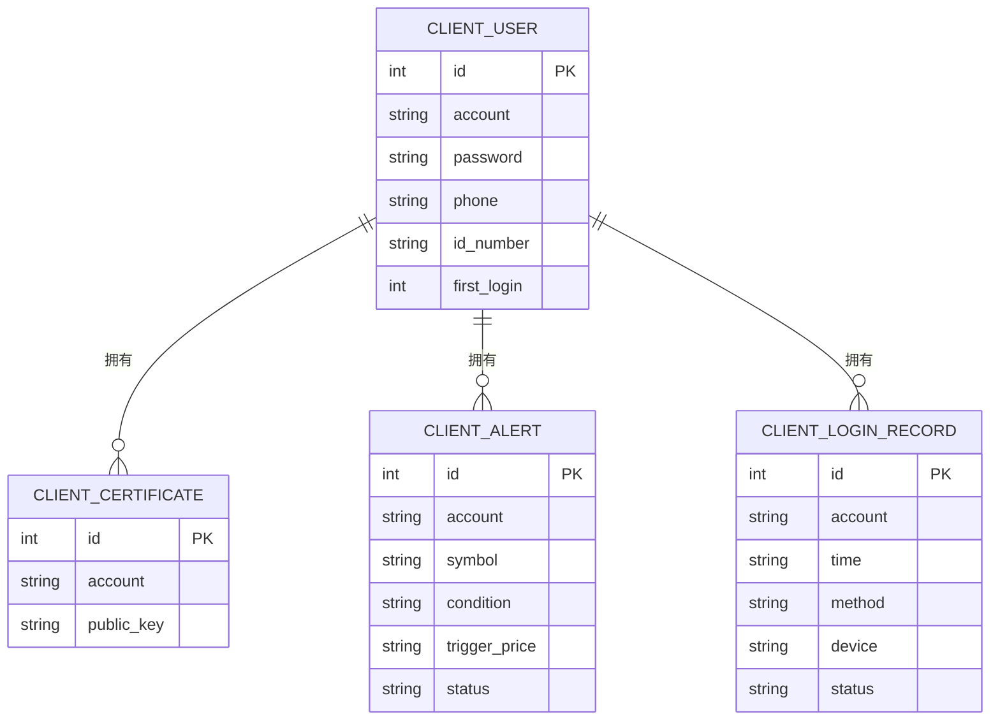

### 6.2 逻辑结构设计（SQLite）

```
client_users(account, password, name, phone, id_number, first_login)
client_certificates(account, public_key, updated_at)
client_sessions(account, token, created_at)
client_login_records(account, time, method, device, status)
client_applications(account, type, status, created_at)
client_alerts(account, symbol, condition, trigger_price, current_price, status, last_triggered)
client_notifications(account, title, content, read, created_at)
client_preferences(account, data)
client_watchlist(account, symbol)
```

### 6.3 物理结构设计（Mock 数据）

- `backend_fastapi/mock_modules/data/mock-funds-db.json`：资金账户、余额、密码、资金流水
- `backend_fastapi/mock_modules/data/mock-securities-db.json`：证券持仓、证券流水
- `backend_fastapi/mock_modules/data/mock-exchange-db.json`：委托与成交
- `backend_fastapi/mock_modules/data/mock-market-db.json`：行情快照

------

## 7. 运行设计

**启动步骤：**

1. 执行 `npm install` 安装依赖
2. 运行 `python -m uvicorn backend_fastapi.main:app --reload --port 8000` 启动后端
3. 运行 `npm run dev` 启动前端

**登录流程：**

1. 输入账号与交易密码
2. 若无证书则自动生成并绑定
3. 已绑定证书则签名挑战码完成验证

**交易流程：**

1. 在交易页输入股票、价格、数量
2. 前端校验资金/持仓
3. 网关提交到 mock 撮合并返回委托与成交

**提醒流程：**

1. 新增提醒（股票/条件/触发价）
2. 刷新价格后更新提醒状态

**数据库重置：**

- 运行 `reset-client-db.cmd` 清空 client SQLite

------

## 8. 系统出错设计

### 8.1 出错信息

| 系统输出信息 | 含义 | 处理办法 |
| --- | --- | --- |
| 账户与密码不能为空 | 登录入参缺失 | 重新输入 |
| 未开通客户端权限 | 未申请客户端权限 | 提交申请 |
| 交易密码错误 | 资金账户验证失败 | 重新输入 |
| 证书验证失败 | 签名或挑战码失效 | 重新登录/重绑 |
| 账户不存在 | mock 账户缺失 | 使用测试账号或重置数据 |
| 委托不可撤销 | 委托已成交或已撤单 | 刷新委托 |
| 取款金额超过可用资金 | 余额不足 | 降低取款金额 |
| 无效的 JSON 数据 | 请求体格式错误 | 检查请求格式 |

### 8.2 补救措施

- 网关或 mock 服务异常时，前端提示“无法连接测试服务”；
- 行情服务异常时，前端显示“行情加载失败”，可手动刷新；
- 证书异常时通过重绑流程重新生成证书。

### 8.3 系统维护设计

1. 网关提供 `/health` 端点用于存活检测。
2. 客户端自有数据保存在 SQLite，可通过脚本重置。
3. mock 服务使用 JSON 文件持久化，便于人工校验与调试。
